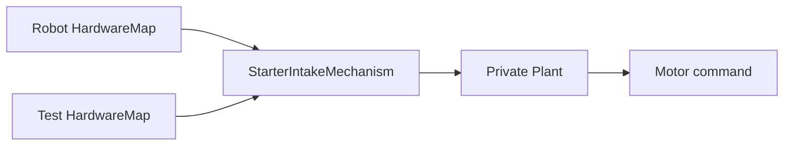

# Test a mechanism without hardware

## Goal

Continue the Starter build by exercising its real intake mechanism and Plant on a development
computer. You will see the difference between requesting a mode, running the output heartbeat, and
observing the actuator command.

**Time:** 30–40 minutes

**Prerequisite:** Complete [Your first Phoenix robot code](<First Phoenix Robot Code.md>). Keep the
copied OpModes disabled and both motion permissions false; this lesson uses no Robot Controller or
physical device.

## What stays real

The test constructs the same production `StarterIntakeMechanism` with the same ordinary
`HardwareMap + Config` constructor used on a robot. The mechanism still privately builds its Plant
through `FtcActuators`, owns the request-to-output path, and updates from a real `LoopClock`.

Only the object supplied as `HardwareMap` changes. `FtcTestHardware` is a test-only registry whose
motor probe records commands. It is not another mechanism constructor or a Plant injected from the
test.



**Text version:**

On a robot, the FTC `HardwareMap` supplies a motor. In this software scenario, the test
`HardwareMap` supplies a recording motor probe. Both flow through the same production mechanism and
its private Plant to one final motor command.

## 1. Copy and run the checked-in scenario

Copy
[`StarterMechanismLessonTest.java`](<https://github.com/harishv-99/2025-PhoenixPedro/blob/master/TeamCode/src/test/java/edu/ftcphoenix/robots/examples/starter/robot/StarterMechanismLessonTest.java>)
into the `edu.ftcphoenix.robots.myrobot.robot` test package created in the first lesson. Let Android
Studio update its package and Starter imports to your copied robot.

Before running, search that copied test for `edu.ftcphoenix.robots.examples.starter` and require
zero matches. Its Starter imports must point to `edu.ftcphoenix.robots.myrobot`; otherwise a green
test could still be exercising the repository's canonical Starter instead of your copied code.

Run only that copied test:

```powershell
.\gradlew.bat --console=plain :TeamCode:testDebugUnitTest --tests edu.ftcphoenix.robots.myrobot.robot.StarterMechanismLessonTest
```

It should end with `BUILD SUCCESSFUL`.

## 2. Follow request, heartbeat, and output

The central scenario has this shape:

```java
StarterIntakeMechanism.Config config =
        StarterIntakeMechanism.Config.defaults();
config.collectPower = 0.37;
config.ejectPower = -0.22;
FtcTestHardware hardware = new FtcTestHardware();
FtcTestHardware.MotorProbe motor =
        hardware.addMotor(config.motorName);
StarterIntakeMechanism intake =
        new StarterIntakeMechanism(hardware, config);
ManualLoopClock time = new ManualLoopClock();

intake.setMode(StarterIntake.Mode.COLLECT);
assertEquals(0, motor.powerWrites());

intake.update(time.clock());
assertEquals(config.collectPower, motor.power(), 0.0);

intake.setMode(StarterIntake.Mode.EJECT);
intake.update(time.nextCycle(0.02));
assertEquals(config.ejectPower, motor.power(), 0.0);

intake.setMode(StarterIntake.Mode.STOPPED);
intake.update(time.nextCycle(0.02));
assertEquals(0.0, motor.power(), 0.0);
```

`setMode(...)` changes semantic intent and stages a Plant request. It does not write the motor.
`update(...)` is the one output heartbeat that realizes the final command. The probe records that
command; it does not pretend the motor rotated.

## 3. Transfer the idea

Before running, predict the recorded command sequence: `0.37`, `-0.22`, then `0.0`. Deliberately
change the EJECT assertion from `config.ejectPower` to `config.collectPower`; the focused test should
turn red because the probe distinguishes the two mechanism requests. Restore `config.ejectPower`
and confirm the test is green again. Production robot code does not change.

If a later subsystem reads a switch, encoder, or velocity, the scenario must inject that input
explicitly. Never copy an output command automatically into feedback; doing so can make a broken
controller appear correct.

### Proves

The configured mode maps through the real production mechanism and Plant to the expected recorded
motor command, and a command is realized only on the mechanism heartbeat.

### Does not prove

No motor physics are modeled. The result does not establish wiring, direction, encoder polarity,
current draw, load response, safe power, physical motion, or STOP behavior on a robot.

### Next gate

Study the optional [hardware-free Reference scenarios](<../examples/Hardware-free Reference Scenarios.md>)
when your subsystem needs sensor or velocity feedback. When hardware exists, begin a separate
supervised [actuator bring-up](<../testing-calibration/Actuator Bring-up.md>) before any subsystem
experiment.
