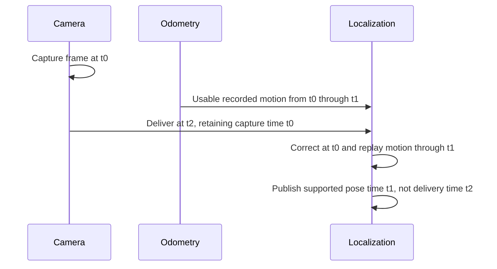
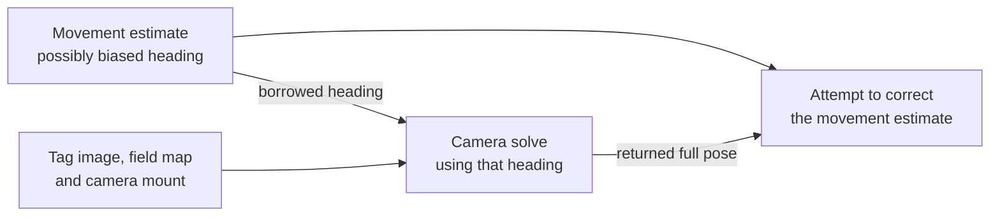

---
tags:
  - Advanced
---

# AprilTag Localization & Fixed Layouts

**Before this page:** read [field-relative drive](<../examples/Field-relative Drive.md>) for heading
and frames, and [one switch](<../build/Read a Switch.md>) for observations and cached status. This
optional reference adds **localization**: estimating the robot's position and facing direction
(its **pose**) in field coordinates. An AprilTag is a printed identifier whose observed size and
orientation help estimate its position relative to the camera. A trusted tag location and measured
camera mount then let the software estimate the robot's field pose.

For a first reading, follow [trusted fixed tags](<#1-detectable-tags-vs-trusted-field-fixed-tags>),
[the three estimation roles](<#2-localization-roles-absolute-pose-vs-motion-prediction>),
[camera ownership](<#3-vision-lane-ownership>), and
[the webcam/raw-tag baseline](<#51-webcam-raw-apriltag-correction>). **Odometry** estimates movement
from wheel/rotation measurements; **correction** uses a field observation to adjust
that estimate. The named `FUSION` baseline adjusts the movement-based estimate using accepted
field-pose corrections. History, direct Limelight field pose, and the uncertainty-modeling
EKF alternative
are optional depth, not extra prerequisites for understanding that baseline. No hardware is needed
to read the model; physical calibration is a separate gate.

This guide explains Sushi's AprilTag-localization policy, the difference between detector
libraries and trusted field layouts, and the framework's three localization roles: **absolute pose
estimators**, **motion predictors**, and **corrected/global estimators**.

The short version:

- **`AprilTagLibrary`** tells a detector which tags exist and how large they are.
- **`TagLayout`** tells Sushi which tag IDs are trusted as fixed field landmarks.
- **`FtcWebcamVisionLane` / `FtcLimelightVisionLane`** owns one physical camera.
- **`AprilTagVision`** borrows that owner's tag capability and exposes a shared `AprilTagSensor`.
- **`AbsolutePoseEstimator`** answers "where is the robot on the field?"
- **`HeadingEstimator`** answers the narrower "which field direction is the robot facing?"
- **`MotionPredictor`** answers both "where is the robot now?" and "how did it move since the last accepted motion baseline?"
- **`CorrectedPoseEstimator`** combines a motion predictor with one absolute correction source.

That split matters because a camera can be shared by localization, alignment, and other vision jobs while the localization stack remains free to choose whether it trusts a raw AprilTag solve, a direct smart-camera pose, or another absolute field-anchor signal.

---

## 1. Detectable tags vs trusted field-fixed tags

These are not the same thing.

### 1.1 Detectable tags

The FTC SDK `AprilTagLibrary` is detector metadata:

- tag IDs
- tag sizes
- FTC-provided field metadata when available

Sushi does **not** assume every tag in that library is safe for global localization. Some FTC seasons include tags that are useful for identification, scoring logic, or driver assists even though their exact placement is not deterministic enough to trust as a fixed field landmark.

### 1.2 Fixed field tags

A Sushi `TagLayout` is the framework contract for **field-fixed** tags only.

Anything that promotes AprilTag observations into a field pose should use a `TagLayout`, not the raw FTC detector library. In practice that includes:

- `AprilTagPoseEstimator`
- corrected/global localization lanes
- calibration tools that depend on field-fixed tags

For official FTC games, the intended entrypoint is:

```java
TagLayout fixedLayout = FtcGameTagLayout.currentGameFieldFixed();
```

That keeps the season-specific "which tags are really fixed?" decision in one framework-owned place.

If you intentionally work with an archived or custom library, use:

```java
FtcGameTagLayout.officialGameFieldFixed(library);
FtcGameTagLayout.fromLibraryFixedIds(library, ids);
FtcGameTagLayout.fromLibraryAllTags(library);   // escape hatch only
```

Use `fromLibraryAllTags(...)` only when you already know every tag in that library is truly fixed in the environment you are solving against.

Every fixed-layout ID must be non-negative, and every position and orientation component of its
field-to-tag pose must be finite. A mutable `SimpleTagLayout` is an authoring convenience, not a
live-tuning handle. Complete it before owner construction. Protected-core retaining owners such as
`AprilTagPoseEstimator`, `SpatialQuerySpec`, and Drive Guidance retain immutable semantic snapshots,
so later edits cannot silently move a trusted landmark inside those existing owners.

---

## 2. Localization roles: absolute pose vs motion prediction

Sushi defines three distinct localization roles.

### 2.1 `AbsolutePoseEstimator`

An `AbsolutePoseEstimator` outputs an absolute robot pose in field coordinates. **Absolute** names
that coordinate frame: it does not mean error-free or independent of the movement estimate. For
example, two estimates can both be wrong because they use the same incorrect camera placement.

Examples:

- `AprilTagPoseEstimator` — solves `field -> robot` from raw AprilTag observations and a trusted `TagLayout`
- `LimelightFieldPoseEstimator` — uses Limelight's direct full-field pose output as an absolute pose source
- line/tape, landmark, beacon, or wall-anchor localizers — if they can directly answer "where is the robot on the field?"

This is the interface most consumers want:

- drive guidance
- go-to-pose tasks
- targeting
- telemetry

Its `PoseEstimate` separates three questions: **availability** (`hasPose`) says whether there is a
pose, **age** says how old its supporting evidence is, and **quality** scores that evidence under
the estimator's rules. An available, high-quality pose can still be too old for a particular
action. Existing guidance and spatial-query consumers check age and quality separately; reading
the pose again does not refresh it. [The optional latency section](<#7-correctedglobal-localization-and-latency-compensation>) explains how the timestamp is chosen when measurements are combined.

Every `AbsolutePoseEstimator` is also a `HeadingEstimator`. Its default heading view projects the
cached pose yaw, availability, quality, and timestamp without advancing localization again. A
consumer that needs only heading—such as field-relative manual drive—therefore avoids depending on
position while remaining compatible with Pinpoint, AprilTag-corrected, or other full localization.
For robots that do not need field position, `FtcImuHeadingEstimator` supplies the same evidence from
the Hub IMU after aligning its raw yaw to an authored robot field heading at START.

`update(clock)` uses the one non-null shared OpMode clock and publishes one attempt-stable snapshot
per cycle. The first attempt owns source/filter/vendor effects; a repeat does not redo them. Finish
camera processor or pipeline transitions before the localization phase so every consumer sees one
coherent frame for that loop.

### 2.2 `MotionPredictor`

A `MotionPredictor` is the predictor side of localization.

It still exposes a current absolute pose estimate, but it also exposes a timestamped `MotionDelta`
describing how the robot moved since its last accepted motion baseline. That lets corrected/global
estimators replay motion through delayed measurements without reverse-engineering deltas from two
unrelated absolute samples.

The absolute estimate and latest delta are one coherent predictor publication. A usable delta ends
at the latest predictor sample and spans a strictly positive current-epoch interval. If a new cycle
has no positive elapsed time, the predictor publishes no usable delta and retains the accepted
motion baseline; the next strictly later sample includes that movement instead of losing it.

Current example:

- `PinpointOdometryPredictor`

Other implementations can include:

- a wheel + IMU dead-reckoner
- a drivetrain-state propagator
- another odometry computer that naturally outputs incremental motion

### 2.3 `CorrectedPoseEstimator`

A `CorrectedPoseEstimator` combines:

- one `MotionPredictor`
- one `AbsolutePoseEstimator` used as the absolute correction source

Sushi currently ships two implementations:

- `OdometryCorrectionFusionEstimator` — simpler gain-based corrected localizer
- `OdometryCorrectionEkfEstimator` — optional corrected localizer that also tracks modeled
  uncertainty, represented by covariance values

Both expose the same high-level contract, so robot code and tools can swap between them intentionally.

---

## 3. Vision-lane ownership

At the FTC boundary, retain one physical camera owner and borrow only the capability a consumer needs:

- `FtcWebcamVisionLane` owns one webcam, one portal, and the complete processor set chosen
  before construction. It supports processor enable/disable and stream/camera controls, but does
  not add processors after the portal is built.
- `FtcLimelightVisionLane` owns one Limelight connection and one requested onboard pipeline.
  It tracks request acceptance, requested-versus-observed pipeline, result generation, freshness,
  and shutdown. A source read never changes the pipeline.

Set `Config.aprilTags` to a fresh `AprilTagConfig.defaults()` to enable the tag capability.
Leave it null to omit tags entirely. `Config.floorObjects` independently enables estimated
floor-object locations; see [Vision targets](<Vision Targets.md>) when that capability is needed.
Both capabilities share the owner's one physical `Config.cameraMount`.

`camera.aprilTags()` returns a stable, non-closeable `AprilTagVision` view. Localization and tag
selection borrow this view; they cannot close the camera. The Limelight view is specifically
`FtcLimelightAprilTagVision`, which also exposes confirmed tag results and a narrow field-yaw
write for advanced vendor diagnostics. Ordinary localization does not submit that yaw. The root
alone retains and closes `camera`.

Those owners preserve the hardware's real differences: webcam processors can coexist, while a
Limelight runs one pipeline at a time. Configure the Limelight AprilTag pipeline in
`Config.aprilTags.pipelineIndex`; `Config.pipelineIndex` separately chooses the initial active
pipeline. Configure that actual device slot as an AprilTag pipeline in the Limelight UI; Sushi's
existing tag-purpose gate confirms the configured index, not the vendor's mislabeled SDK pipeline-type
getter. Robot policy calls `requestPipeline(...)` only at a deliberate activity change.

Their Config objects are mutable authoring drafts. A direct owner validates and snapshots its
complete active config before device lookup. A deferred `AprilTagCameraFactories.webcam(cfg)`
or `.limelight(cfg)` validates and captures when the factory is created, and a later `open(...)`
returns an `OwnedAprilTagCamera` containing a fresh owner and its borrowed tag view. Retain the authored config when configuration
provenance matters; runtime lanes expose focused identity, mount, readiness, and diagnostics rather
than exporting another construction Config.

For webcam AprilTags, a supplied FTC `AprilTagLibrary` is the one deliberate raw-copy exception:
`Config.copy()` retains that borrowed SDK object so copying an inactive profile branch cannot fail.
The active factory or lane resolves the current-game default when needed, validates the metadata,
canonicalizes tag sizes and field positions to inches, and deep-snapshots the complete library.
Later mutation of the source library, metadata array, position vectors, or quaternions cannot drift
the running processor. Construct a fresh factory or owner to adopt changed metadata.

When `FtcWebcamVisionLane` also owns custom processors, its
`setAprilTagProcessorEnabled(...)` and `isAprilTagProcessorEnabled()` operations let the
robot-owned mode realization control the built-in AprilTag processor without exposing that SDK
processor instance.

### 3.1 Selectable calibration and localization tools

`CameraMountCalibrator`, `AprilTagLocalizationTester`,
`PinpointAprilTagCorrectedLocalizationTester`, and the optional-assist path of
`PinpointPodOffsetCalibrator` use one construction story. Author a fresh tool Config, put the fixed
layout and mount-free localization policy there, and pass a
`Function<String, AprilTagCameraFactory>` separately. The webcam/Limelight backend Config—not
the tool Config—owns camera mount and detector-library answers. See
[`AprilTag Practice Setup`](<AprilTag Practice Setup.md>) for the complete call shape.

The tool constructor validates and snapshots active data before using a child context. A preferred
device applies the builder immediately; a picker applies it once per confirmed selection. The
deferred factory then opens a fresh `OwnedAprilTagCamera` handle. The builder/template and any borrowed custom SDK tag
library must remain stable for the tester's whole lifetime because a clean picker retry may apply the
builder again. Tool defaults are valid software baselines, not evidence that a camera, mount, library,
or field placement is physically correct.

The shared AprilTag policy and corrected-localization Configs expose context-aware validated copies
so intrinsic age, solver, predictor, source-selection, and selected Fusion/EKF facts fail before a
portal or Pinpoint effect. Actual borrowed-capability subtype, mount/sensor accessors, and readiness remain honest
post-open facts. A non-null `NOT_READY` retains the owner for another poll; a null contract fact or
`RuntimeException` detaches and closes the published lane once when cleanup succeeds. An `Error`
propagates immediately without promised cleanup. If the lane remains published and STOP is later
invoked, that boundary closes the still-retained owner.

Each tool snapshots `fixedTagLayout` with one IDs read and one pose read per ID. For an FTC game
layout it retains the immutable policy summary plus the captured IDs/poses, but deliberately does
not retain the mutable source merely to reproduce richer per-key debug rows. An empty layout stays
empty: it can show raw detections, but cannot publish a fixed-layout mount sample or AprilTag field
correction. Pinpoint prediction or configured direct-Limelight correction remains governed by its
own evidence.

For either physical camera, borrow the same tag contract:

```java
AprilTagVision vision = camera.aprilTags();
AprilTagSensor tags = vision.tagSensor();
CameraMountConfig mount = vision.cameraMountConfig();
VisionReadiness readiness = vision.readiness(clock);
```

The supplied webcam and Limelight owners perform frame construction automatically; ordinary robot
code reads `camera.aprilTags().tagSensor()` and does not manage timestamps. Only an advanced custom
`AprilTagSensor` adapter builds tag geometry and attaches its acquisition owner's one timestamp at
the frame boundary:

```java
List<AprilTagObservation> observations = Arrays.asList(
        AprilTagObservation.target(5, cameraToTagPose),
        AprilTagObservation.target(8, otherCameraToTagPose, fieldToRobotPose)
);
AprilTagDetections frame = AprilTagDetections.fromFrame(frameTimestamp, observations);
```

Every observation returned by `frame` retains that exact `LoopTimestamp`, so caching the frame or a
selected observation does not make it newly captured. `AprilTagDetections.none()` means there is no
trustworthy processed frame. In contrast,
`AprilTagDetections.fromFrame(frameTimestamp, Collections.emptyList())` means a trustworthy frame
was processed and contained no usable tags. `AprilTagObservation.noTarget()` remains a lookup/result
sentinel and is never inserted into a frame.

FTC owners translate vendor timing once per stable camera frame/result identity. Re-reading a
cached SDK result returns its original Sushi timestamp; it never recomputes `now - cachedAge`.
After a deliberate `LoopClock.reset(...)`, that retained identity fails closed until the camera
publishes a genuinely new frame/result in the current clock epoch. Robot code does not manage frame
IDs, reset epochs, or timestamp caches.

Choosing **which tag a behavior refers to** is separate from estimating robot pose. A robot with
one configured target can refer directly to that id; it needs no visibility selector. For a choice
among tags, share one completed `TagSelectionSource`:

- `TagSelections.fromVisibleTags(tags, mount)` ranks real current tag observations after
  `among(...)` and `freshWithinSec(...)`.
- `TagSelections.fromFieldPose(estimator, fixedLayout, mount)` ranks known field tags relative to
  an already-published robot pose; its stages additionally require `minQuality(...)`. It does not
  claim that any tag was seen.

Both paths then answer `choose(policy)` and finish with `continuous()` or an explicit held-selection
lifetime such as `holdWhile(attemptActive)`. Holding keeps the selected ID for that attempt even
when another tag would win now; it does not keep missing geometry usable. The lifetime answer
returns the source directly. Policies see one immutable list of candidates with camera-relative and robot-relative
geometry. The observed path retains the actual observation; the field-pose path retains pose
evidence instead, without fabricating a camera frame. Selection never updates localization.

Selection samples, sticky/loss state, diagnostics, result, and cycle publish together only after
all required reads succeed. A failure cannot silently latch a partial winner or make the previous
result look current; recursive selection fails clearly and a later nonrecursive same-cycle call
may retry. Reset clears only the selector's local state, not borrowed camera, mount, enable, or
pose inputs. See [Spatial Queries](<Spatial Queries.md>) for the full selection/reference contract.

For Limelight, `ResultSnapshot.frameTimestamp()` is the owner's best SDK-supported estimate of
camera exposure time: Control Hub receipt staleness plus the reported capture and targeting
latencies are translated once when a new result identity appears. It is not a claim of measured
network or physical exposure accuracy. `resultReceivedAtControlHubMillis()` remains a separate
transport/diagnostic fact; use the frame timestamp for localization and observation freshness.

`readiness` describes the configured AprilTag component, not whether a tag is currently visible.
A streaming webcam with its required processor enabled can be ready with zero detections. A
Limelight AprilTag lane becomes ready only after it is running, connected, accepted the pipeline
request, and observed a fresh post-request result from that pipeline; that result may still report
no target.

Keep the Limelight polling rate at its 100 Hz framework default unless real-device testing gives a
specific reason to change it. The FTC SDK evaluates connection activity over a short fixed window,
so unusually low polling rates can make readiness appear to alternate between connected and
disconnected even when the device is otherwise healthy.

What changes is only how raw AprilTag observations are acquired:

- `FtcWebcamVisionLane` uses a `WebcamName` plus FTC VisionPortal / FTC AprilTag processing.
- `FtcLimelightVisionLane` requests the configured initial pipeline; its borrowed tag view confirms a
  fresh result from that pipeline, and adapts its fiducial results into the same `AprilTagSensor`
  seam. Limelight also exposes direct device field pose and a narrow orientation-update operation,
  which Sushi can optionally consume through a separate absolute-pose estimator path without
  borrowing the mutable device.

Robot code supplies both backends only a Sushi `CameraMountConfig` (`+X` forward, `+Y` left,
`+Z` up; radians). The webcam owner performs the FTC SDK's less-obvious conversion internally:
camera position is expressed in FTC robot axes while orientation rotates the optical-camera axes
using the SDK's intrinsic-ZXZ convention. A forward-facing Sushi identity orientation therefore
maps to the SDK's documented `(yaw=0, pitch=-90°, roll=0)` baseline; students do not add a second
SDK pitch correction.

The important policy is: **the camera lane owns device lifecycle and trustworthy acquisition;
localization owns estimation strategy.** Close the owner at shutdown. After close succeeds, a retry
constructs a new owner; it does not revive a closed portal or reuse its processor instances. If
close fails, do not create a competing owner in the same OpMode; stop and restart the OpMode first.

For season-specific multi-purpose vision, put a robot-owned typed interface above either advanced
owner. Auto and TeleOp can then select semantic modes such as `DRIVER_VIEW` or `AIMING` and consume
one immutable timestamped robot snapshot. The webcam realization maps a mode to processor enablement; the
Limelight realization maps the same mode to one pipeline request. FTC and Limelight result types
remain inside those realization classes.

---

## 4. The standard corrected-localization lane

`FtcOdometryAprilTagLocalizationLane` is the standard FTC-boundary owner for the common "predictor + tags + corrected/global pose" stack.

It owns:

- one `PinpointOdometryPredictor`
- one raw `AprilTagPoseEstimator`
- optionally one `LimelightFieldPoseEstimator`
- one selected absolute correction source
- one corrected/global estimator (`OdometryCorrectionFusionEstimator` or `OdometryCorrectionEkfEstimator`)

That means one lane can expose all of these views at once:

- predictor pose
- raw AprilTag pose
- optional direct Limelight field pose
- the currently active correction estimator
- the corrected/global pose

This is exactly why the framework does **not** need a new fusion class for every sensor combination. Instead, it composes a few primitive roles cleanly.

---

## 5. Common usage patterns

### 5.1 Webcam + raw AprilTag correction { #51-webcam-raw-apriltag-correction }

This is the most common baseline.

```java
FtcWebcamVisionLane.Config camCfg = FtcWebcamVisionLane.Config.defaults();
camCfg.webcamName = "Webcam 1";
camCfg.aprilTags = FtcWebcamVisionLane.AprilTagConfig.defaults();
camCfg.cameraMount = solvedCameraMount;

FtcWebcamVisionLane camera = new FtcWebcamVisionLane(hardwareMap, camCfg);
AprilTagVision vision = camera.aprilTags();

FtcOdometryAprilTagLocalizationLane.Config locCfg =
        FtcOdometryAprilTagLocalizationLane.Config.defaults();
locCfg.predictor.hardwareMapName = "pinPoint";
locCfg.estimation.correctionSource.mode =
        FtcOdometryAprilTagLocalizationLane.CorrectionSourceMode.APRILTAG_POSE;
locCfg.estimation.correctedEstimatorMode =
        FtcOdometryAprilTagLocalizationLane.GlobalEstimatorMode.FUSION;

FtcOdometryAprilTagLocalizationLane localization =
        new FtcOdometryAprilTagLocalizationLane(
                hardwareMap,
                vision,
                FtcGameTagLayout.currentGameFieldFixed(),
                locCfg
        );
```

Register `camera.close()` at the composition root's shutdown boundary. Do not close or reset
borrowed vision from localization.

This gives you:

- Pinpoint-based motion prediction
- raw AprilTag field solves from the webcam
- corrected/global localization using the raw AprilTag solve as the absolute correction source

### 5.2 Limelight + raw AprilTag correction

If you want Limelight to behave like a smart AprilTag camera but keep Sushi's own raw-tag pose solve as the correction source:

```java
FtcLimelightVisionLane.Config llCfg = FtcLimelightVisionLane.Config.defaults();
llCfg.hardwareName = "limelight";
llCfg.aprilTags = FtcLimelightVisionLane.AprilTagConfig.defaults();
llCfg.aprilTags.pipelineIndex = 0;
llCfg.pipelineIndex = llCfg.aprilTags.pipelineIndex;
llCfg.pollRateHz = 100;
llCfg.cameraMount = solvedCameraMount;

FtcLimelightVisionLane camera = new FtcLimelightVisionLane(hardwareMap, llCfg);
AprilTagVision vision = camera.aprilTags();

FtcOdometryAprilTagLocalizationLane.Config locCfg =
        FtcOdometryAprilTagLocalizationLane.Config.defaults();
locCfg.predictor.hardwareMapName = "pinPoint";
locCfg.estimation.correctionSource.mode =
        FtcOdometryAprilTagLocalizationLane.CorrectionSourceMode.APRILTAG_POSE;
locCfg.estimation.correctedEstimatorMode =
        FtcOdometryAprilTagLocalizationLane.GlobalEstimatorMode.FUSION;
```

Everything above `AprilTagVision` still consumes the same `AprilTagSensor` seam.

### 5.3 Limelight + direct field-pose correction

If you want corrected/global localization to trust the Limelight's direct full-field pose instead of Sushi's raw-tag solve:

First configure Full 3D processing and the robot-relative camera placement on the Limelight, and
verify its field map, as described in the [FTC setup instructions](<https://docs.limelightvision.io/docs/docs-limelight/apis/ftc-programming>).
The device's placement must agree with Sushi's `CameraMountConfig`; assigning that Java Config
does not upload camera-placement settings to the device.

```java
FtcOdometryAprilTagLocalizationLane.Config locCfg =
        FtcOdometryAprilTagLocalizationLane.Config.defaults();
locCfg.predictor.hardwareMapName = "pinPoint";
locCfg.estimation.correctionSource.mode =
        FtcOdometryAprilTagLocalizationLane.CorrectionSourceMode.LIMELIGHT_FIELD_POSE;
locCfg.estimation.correctedEstimatorMode =
        FtcOdometryAprilTagLocalizationLane.GlobalEstimatorMode.FUSION;
locCfg.estimation.correctionSource.limelightFieldPose.maxResultAgeSec = 0.20;
locCfg.estimation.correctionSource.limelightFieldPose.minVisibleTags = 2;
locCfg.estimation.correctionSource.limelightFieldPose.degradeWhenMoving = true;
```

This gives you two absolute pose views side by side:

- `localization.aprilTagPoseEstimator()` — Sushi's raw-tag field solve
- `localization.limelightFieldPoseEstimator()` — Limelight's direct device field pose

and the corrected/global estimator will use the configured correction source.

The direct source uses only Limelight's standard `botpose` (MegaTag1). There is no second pose-mode
choice or automatic heading submission. An unavailable standard botpose stays unavailable even
when a raw MegaTag2 result exists. The two pose views can share image or calibration errors; their
agreement is not an independent accuracy check. See [shared evidence](<#check-whether-two-estimates-share-evidence>)
when interpreting that comparison.

### 5.4 Reusing an external Auto predictor

When an Auto integration already owns physical odometry, inject its backend-neutral predictor
instead of constructing another Pinpoint instance:

```java
FtcOdometryAprilTagLocalizationLane localization =
        FtcOdometryAprilTagLocalizationLane.withPredictor(
                autoRuntime.motionPredictor(),
                vision,
                fixedFieldTagLayout,
                locCfg.estimation
        );
```

`locCfg.predictor` applies only to the ordinary `HardwareMap` constructor. The injected path takes
only `locCfg.estimation`, so it cannot retain or report an ignored Pinpoint answer. A Pedro Auto
composition can use this path so Pinpoint is configured, reset, polled, and corrected by one owner
while Pedro consumes a passive converted view.

Pinpoint construction always requests one non-blocking reset. A poll whose cached device status is
not `READY` publishes unavailable measured pose, velocity, and motion; the first later `READY`
sample establishes fresh baselines instead of bridging across calibration. Keep the robot still
during reset/recalibration and gate motion-producing calibration or Pedro heartbeats on current
pose and velocity evidence. There is no constructor sleep or guessed reset delay.

### 5.5 Which one should I start with?

Recommended order:

1. Start with **webcam or Limelight raw AprilTag correction** (`APRILTAG_POSE`).
2. Verify camera mount, tag policy, and predictor quality.
3. Then try **direct Limelight field pose** (`LIMELIGHT_FIELD_POSE`) only after the raw-tag path already makes sense.
4. Compare corrected/global behavior, especially while the robot is moving.

That makes it easier to separate "camera rig / field map / mount is wrong" from "direct device pose is noisier than expected in motion."

---

## Optional: trajectory continuity and planar history { #24-trajectory-continuity-and-optional-planar-history }

Read this section only when a delayed observation needs an earlier robot pose. **Interpolation**
estimates between two stored observations; it does not measure a missing pose. A **continuity
segment** identifies published poses that may belong to one uninterrupted coordinate history,
so a reset cannot silently join two different coordinate stories.

`MotionPredictor` and `CorrectedPoseEstimator` are both `PoseTrajectoryEstimator`s. In addition to
their cached pose, they expose one opaque publisher-local `trajectorySegmentId()`. Equality is the
only valid operation on that value. Physical motion and ordinary accepted corrections stay in the
same corrected segment. A deliberate pose reset or coordinate rebase changes it. If Fusion or EKF
pushes an accepted correction into its private predictor, the raw predictor changes segment while
the final corrected trajectory does not. If a corrected estimator instead observes an unexpected
predictor rebase, it clears replay state, changes its own segment, and establishes a fresh base from
coherent current evidence rather than applying a motion interval across the reset.

Sparse AprilTag and Limelight field-pose estimators remain plain `AbsolutePoseEstimator`s. Their
delayed frames are measurements, not a continuous high-rate trajectory that can honestly be
interpolated.

When a robot needs its historical planar field pose, construct one optional `PlanarPoseHistory`
over the authoritative final stream:

```java
PlanarPoseHistory.Config historyCfg = PlanarPoseHistory.Config.defaults();
historyCfg.retentionSec = 0.50;
historyCfg.maxSamples = 128;

PlanarPoseHistory poseHistory =
        new PlanarPoseHistory(localization.globalEstimator(), historyCfg);
TimeAwareSource<PlanarPoseHistory.Lookup> poseAtTime = poseHistory.lookupSource();
```

For odometry-only Pedro code, bind `runtime.motionPredictor()` instead. Do not construct one history
inside every localization implementation. If a robot deliberately records both raw odometry and a
corrected global estimate, those are two different datasets and should have two explicitly owned
history instances.

The existing localization lifecycle owner retains the concrete history and makes order explicit:

```java
// START: after the shared clock reset
poseHistory.reset();
globalEstimator.setPose(startingPose);
localization.update(clock);
poseHistory.recordCurrent(clock);

// LOOP
localization.update(clock);
poseHistory.recordCurrent(clock);   // before timestamped downstream consumers

// STOP: after owned localization resources stop
poseHistory.reset();
```

`recordCurrent(clock)` reads only the estimator's cached publication; it never advances or resets
localization. The stable `lookupSource()` is a borrowed read-only projection, so calling `reset()`
on that projection cannot clear the concrete owner's history. Only `poseHistory.reset()` clears it
and releases its clock binding for another lifecycle.

Recording also requires evidence at the current loop time. An available corrected pose with an
older timestamp is not a new current sample: the history records a gap, preserving eligible older
entries but refusing to interpolate across that gap. A large quality score cannot override this
time check.

The default lookup horizon is 0.50 seconds with a hard bound of 128 samples; each successful record
heartbeat also prunes samples beyond that horizon. Interpolation spans at most 0.10 seconds, 12
inches of translation, and pi/2 radians of shortest-path yaw. Configuration is a mutable authoring
draft that the owner validates and snapshots. A lookup preserves eligible exact samples;
otherwise it linearly interpolates field x/y, interpolates yaw over the shortest wrapped path, and
uses the lower of the two endpoint qualities. It never extrapolates, clamps, chooses a nearest
sample, or falls
back to current pose. Typed unavailable results distinguish an empty or evicted history, an invalid
request time, before/after bounds, a continuity gap, and an excessive time, translation, or yaw
bracket. A request timestamp from another `LoopClock` is a wiring error.

This is as-published history, not retrospective smoothing. A later correction never rewrites an
older entry. A large but accepted correction remains in the corrected estimator's segment, while
the history's translation/yaw bounds reject only that interpolation bracket.

---

## 6. Raw AprilTag solving policy

Sushi's shared AprilTag solver does this:

- gather visible observations whose IDs are in the trusted `TagLayout`
- compute one candidate `field -> robot` pose per visible fixed tag
- weight closer / more centered tags more strongly
- prefer observation-provided field pose when it agrees with Sushi's explicit geometry and remains plausible
- choose a consensus seed
- reject outliers
- compute one fused field pose and a quality score

That policy belongs to `AprilTagPoseEstimator`, which can feed the corrected localizer. Field
guidance consumes the chosen estimator's already-published pose; it does not run another
tag-to-field solve or blend an image-based steering answer with field-based steering. A robot
without field localization may instead deliberately choose relative-AprilTag guidance for
observed tag-relative alignment. That mode does not create a robot field pose.

When an observation already supplies a field pose, agreement with explicit camera/tag geometry
allows the solver to select that candidate; it does not count the two alternatives as independent
measurements. They can share the same image, mount, and field-layout mistakes. Compare against
independently known robot placement before treating agreement as evidence of physical accuracy.

### Keep field solving in the localization owner

`AprilTagPoseEstimator.Config` contains two data-only policy answers: `fieldPoseSolver` and
`maxDetectionAgeSec`. The solver Config is not an estimator subtype. The camera mount is a
separate constructor dependency, just like the borrowed sensor; it is not a second mount answer
inside policy Config. Each retaining owner validates and snapshots its authored policy.

For advanced direct assembly, convert the FTC lane's authored AprilTag policy without passing a
mount into that conversion. The `tags` and `mount` below come from the same borrowed camera view
shown in section 3; `fixedLayout` contains the trusted field landmarks:

```java
AprilTagPoseEstimator.Config tagCfg = locCfg.estimation.aprilTags
        .toAprilTagPoseEstimatorConfig();
AprilTagPoseEstimator tagLocalizer =
        new AprilTagPoseEstimator(tags, fixedLayout, mount, tagCfg);
```

The ordinary `FtcOdometryAprilTagLocalizationLane` constructs that owner for you; do not add this
direct owner beside the lane. A custom composition may use `tagLocalizer` as its correction source
as described in section 7. Its lifecycle owner updates it before downstream consumers.

Field guidance then reads the authoritative estimate. Here `correctedLocalizer` is the completed
corrected owner, updated earlier in the same shared loop. This plan faces field heading zero and
uses no camera-side fallback:

```java
DriveGuidancePlan plan = DriveGuidance.plan()
        .faceTo()
            .fieldHeadingRad(0.0)
        .solveWith()
            .absolutePose(correctedLocalizer)
            .maxAgeSec(0.50)
            .minQuality(0.10)
            .onLoss(DriveGuidanceSpec.LossPolicy.PASS_THROUGH)
            .doneAbsolutePose()
        .build();
```

These explicit age and quality limits match the framework's software defaults; they are not
physical accuracy or safety guarantees. Guidance checks evidence without updating localization.
With insufficient evidence, `PASS_THROUGH` leaves unsolved drive channels to the surrounding
drive composition. A field tag target additionally supplies `fixedAprilTagLayout(fixedLayout)`
in that branch; the layout defines the target, not a hidden pose solver.

For a moving camera, the advanced estimator overload takes a borrowed
`TimeAwareSource<CameraMountConfig>`. It looks up the mount at the accepted frame's original
capture timestamp. The provider must retain genuine mount history; a current-only substitute
cannot correct a delayed image. The estimator neither advances nor resets the provider, and a
failed/null lookup fails that update under its retained same-cycle failure contract. For a fixed
camera, the ordinary `CameraMountConfig` constructor argument supplies the one immutable mount.

Use `FixedTagFieldPoseSolver.Config.defaults()` and `CameraMountConfig.identity()` only when
those software/geometry baselines are intended. Identity describes a camera at the robot origin
with matching axes; neither baseline proves a physically calibrated camera or field.

---

## 7. Corrected/global localization and latency compensation

**Latency** is the delay between capturing an observation and using it. The robot may move during
that delay, so a camera result should not be treated as a fresh measurement of its current pose.
**Capture time** is when the camera observed the robot; **delivery time** is when the loop receives
that result. The combined estimate's **supported pose time** is the endpoint reached by evidence
the estimator actually incorporates. It can be earlier than delivery time. One composite
timestamp does not promise that every coordinate was independently refreshed.



In this illustrative timeline, `t0 < t1 < t2`: the image describes `t0`, recorded motion supports
`t1`, and delivery occurs at `t2`. **Replay** means adjusting the earlier estimate and reapplying
usable recorded motion. The result still represents `t1`; it is not proof of exact physical
position or of movement between `t1` and `t2`. With motion evidence through the current loop, the
result can instead represent the current loop. If a correction is older than the state being
updated and no continuous usable history connects those times, both estimators reject it rather
than assume that the robot stood still.

When you combine a `MotionPredictor` with an absolute correction source, Sushi's corrected estimators do three important reliability jobs:

- deduplicate repeated absolute measurements by measurement timestamp
- consume each predictor motion interval once by its end timestamp, independently of cycle guards
- align an older correction through usable history to the supported pose time, never merely to its delivery time

A correction whose capture time is at or after both the represented state and any usable predictor
endpoint can be applied directly to the retained estimate. It does not reconstruct any unobserved
motion. A camera-only initialization therefore uses capture time, not acceptance time, even when
the frame arrives late. **Projection** is the alternative of moving a camera pose to a supported
later time using recorded motion before blending it; it also needs that motion evidence.

`enableLatencyCompensation` defaults to `true`: supported replay, projection, and direct updates
are eligible. Setting it to `false` permits only eligible direct updates, not blending an older
camera pose into a newer state without alignment. An age limit and enough configured history
capacity are necessary checks, but cannot supply missing startup samples or fill a motion gap.

These measurements carry one `LoopTimestamp`, not a separate timestamp number plus an age or reset
counter. The value keeps its `LoopClock` and reset epoch attached internally. Estimators derive age
with `estimate.timestamp.ageSec(clock)`, and history owners compare two captured times with
`newer.secondsSince(older)`. Robot code never stores or compares an epoch. A deliberate clock reset
automatically makes retained pre-reset timestamps ineligible for freshness or replay; correction
estimators clear their affected history and wait for current-epoch measurements rather than
interpolating across the reset.

An unavailable timestamp means that no truthful measurement time exists. It is not equivalent to
"captured now," and localization must fail closed when a timed pose or motion delta cannot be
placed in the current clock epoch. Passing a timestamp from a different `LoopClock` is a wiring
error: keep one stable loop clock for the complete OpMode.

“In the current clock epoch” does not mean “measured this loop.” A predictor that keeps returning
the same old sample can leave an available corrected estimate with its old timestamp. Existing
consumer age limits decide whether to use it. If the predictor is missing or invalid and no new
correction incorporates pose evidence, the estimators publish no pose while retaining internal
recovery state. Conversely, newly acquired stationary samples can be fresh: a coherent,
positive-duration motion interval with zero movement still advances time. Unchanged coordinates
alone cannot distinguish stationary motion from frozen evidence.

A pose can be available without being equally useful for every action. Its `PoseEstimate.quality`
is a score from `0` to `1`, with larger values meaning better evidence according to that estimator's
rules. It is a **heuristic**: a useful software rule, not a measured probability that the robot's
position is correct.

Typical Fusion setup:

```java
OdometryCorrectionFusionEstimator.Config fusionCfg =
        OdometryCorrectionFusionEstimator.Config.defaults();
fusionCfg.maxCorrectionAgeSec = 0.35;
fusionCfg.predictorHistorySec = 1.0;  // capacity must cover maxCorrectionAgeSec; usable samples are still required
fusionCfg.correctionConfidenceHoldSec = 0.75;  // the default quality-contribution duration

OdometryCorrectionFusionEstimator corrected =
        new OdometryCorrectionFusionEstimator(predictor, absoluteCorrection, fusionCfg);
```

An accepted camera correction can temporarily raise the reported score. Fusion starts that
contribution at the accepted measurement's own quality and fades it evenly to zero over
`correctionConfidenceHoldSec`. Change the assignment above before construction, or the same field
under `locCfg.estimation.correctionFusion` when using the FTC lane. The duration must be finite and
non-negative; `0` disables this contribution.

Fusion reports the larger of the predictor score and this fading contribution, never their sum.
For positive duration `H` and elapsed seconds `a` since acceptance, while `0 <= a < H`, the rule is
`max(predictorQuality, acceptedQuality * (1 - a / H))`; `max` means choose the larger value.
At or after expiry, only predictor quality contributes. A clock reset makes an old contribution
ineligible. These rules do not make an otherwise unavailable pose available.

For an illustrative predictor score of `0.2`, accepted correction quality of `0.4`, and the default
`0.75`-second duration, with no further accepted correction:

| Seconds since acceptance | Correction contribution | Reported Fusion quality |
| --- | --- | --- |
| `0.000` | `0.4` | `0.4` |
| `0.375` | `0.2` | `0.2` |
| `0.750` and later | `0.0` | `0.2` |

The temporary contribution shrinks, but the predictor keeps the reported score at least `0.2`.
These are software-example values, not recommended robot thresholds. Pinpoint instead defaults
to a fixed configured quality of `0.75` when it has a usable pose; it does not measure accumulating
odometry drift and reduce that score automatically. A weaker camera contribution therefore cannot
lower that predictor score.

The hold starts when Fusion **accepts** a correction, not when the image was captured. Capture time
still controls freshness and delayed-motion replay. Only a newly accepted correction replaces the
retained quality and restarts the hold, even if it is weaker. Rejected or repeated frames do neither.
Disabling corrections stops new acceptance; an earlier contribution can still finish fading.

This score is separate from how far Fusion moves the estimated pose toward a camera observation.
A **gain** determines how much of the gap toward that observation to close. Fusion multiplies
its configured position and heading gains by the accepted correction's quality, then limits each
result to the range `0` to `1`. These are the **effective gains**: `0` ignores that component of
the observation, while `1` uses it completely. Predictor quality is not another blending weight.
Changing the hold changes reporting, not those pose gains.

Acceptance and new pose evidence are different facts. If both effective Fusion gains are zero,
an ordinary accepted correction still updates acceptance diagnostics and the quality hold, but
does not advance pose time or restore missing-predictor availability. A positive effective gain
can incorporate new evidence even when the measured pose agrees exactly. Check
`estimate.timestamp.ageSec(clock)` separately from its score; a new acceptance time or large
quality value cannot make old pose evidence fresh.

A manual `setPose(...)` asserts a known pose and clears the earlier correction contribution. Its
immediate score uses the predictor's reported quality when it reports a pose, otherwise `1.0`;
that fallback expresses the caller's assertion, not new camera evidence or proven accuracy.
A manual anchor uses the owner's last actual publication-loop boundary, not an aged estimate's
evidence time; before the first publication its time is unavailable. Re-reading a cache does not
move that boundary. An automatic correction may be retained locally at an older supported time,
but can be pushed through `PoseResetter` only when that endpoint is current. That reset API has
no historical-time argument and must not turn an old correction into a present assertion.

Optional EKF setup: an **extended Kalman filter** tracks uncertainty as well as an estimate.
Its covariance values describe modeled uncertainty, not measured physical error. EKF uses
measurement quality in that model and derives its output score from covariance, not Fusion's
fading contribution. These are additional modeling/tuning decisions,
not required knowledge for the ordinary Fusion baseline. Use this alternative only when your team
can justify those assumptions and evaluate the resulting evidence:

```java
OdometryCorrectionEkfEstimator.Config ekfCfg =
        OdometryCorrectionEkfEstimator.Config.defaults();
ekfCfg.maxCorrectionAgeSec = 0.35;
ekfCfg.predictorHistorySec = 1.0;

CorrectedPoseEstimator corrected =
        new OdometryCorrectionEkfEstimator(predictor, absoluteCorrection, ekfCfg);
```

Notes:

- `predictorHistorySec` must be at least `maxCorrectionAgeSec` when latency compensation is enabled;
  active configuration rejects a shorter capacity. An otherwise fresh frame can still be rejected
  when actual history is missing, evicted, or crosses an unsupported motion gap.
- EKF's `projectedCorrectionPositionStdPerSec` and `projectedCorrectionHeadingStdPerSec` retain
  conservative age-based uncertainty for eligible delayed non-replayed updates. Their defaults
  are `4.0 in/s` and `12 degrees/s` (stored in radians/s); change them on `ekfCfg` before
  construction or under `locCfg.estimation.correctionEkf`. They do not authorize a missing-history
  fallback or measure physical error. Admitted quality zero is finite measurement uncertainty in
  EKF, not automatically a zero-weight update.
- corrected estimators consume an explicit `MotionDelta` from the predictor instead of
  reverse-engineering motion from two unrelated pose snapshots.
- repeated same-cycle updates cannot apply that delta or EKF process covariance twice, and a retained
  equal/older predictor timestamp does not clear valid replay history.
- predictor pose evidence must be finite and belong to the current clock epoch. A claimed
  `MotionDelta` additionally needs finite planar components/quality, positive coherent duration,
  and an end timestamp matching the latest predictor sample. `hasDelta == false` remains valid
  absence, but a newer `MotionDelta.none(...)` alone does not move an already-corrected estimate
  forward except through a supported baseline/reacquisition path.
- correction timestamps must belong to the current clock epoch. Unavailable/materially-future
  timestamps do not advance the watermark; duplicate/out-of-order frames retain their skip
  classification; a strictly newer stale frame is rejected once. `maxCorrectionAgeSec == 0`
  inclusively accepts only a current-time correction.
- every incorporated correction/manual pose anchor excludes predictor motion from before that anchor. When the
  corrected pose is pushed into the predictor, both baselines move together. With push-back
  disabled, the estimator derives the first later motion from a predictor pose captured at or
  after the anchor; if no such pose exists yet, the first interval that straddles the anchor is
  consumed only as a new baseline rather than risking replay of its pre-anchor prefix.
- `PoseEstimate` and `MotionDelta` expose `LoopTimestamp` values; derive age or duration from those
  values instead of retaining a second scalar age.

Correction diagnostics separate accepted-loop time (`lastCorrectionAccepted`) from camera
capture time (`lastAcceptedCorrectionMeasurementTimestamp`) and the pose's own timestamp.
`acceptedCorrectionCount` is the sum of `replayedCorrectionCount` and
`nonReplayedCorrectionCount`; the latter includes direct and supported projected updates, not
just projections. `lastCorrectionUsedReplay` describes the last accepted correction and is not
replaced by a rejected, duplicate, or out-of-order candidate. Lifecycle clears can clear that
last-accepted status without erasing lifetime counts. None of these counters proves freshness,
physical accuracy, or permission to drive.

---

## 8. Direct Limelight field pose in motion

Some teams report that direct device field pose can degrade while the robot is moving.

Potential causes include:

- motion blur
- rolling-shutter / capture delay effects
- stale frames
- single-tag geometry sensitivity
- misconfigured camera mount or field map
- aggressive robot rotation between capture time and robot-loop time

Sushi's direct Limelight field-pose estimator is intentionally conservative:

- freshness gating (`maxResultAgeSec`)
- visible-tag gating (`minVisibleTags`)
- optional motion-aware quality degradation (`degradeWhenMoving`)
- optional hard reject thresholds (`rejectWhenMovingTooFast`)
- standard botpose only; the optional predictor supplies cached motion for these gates, not
  heading for the camera's pose solve

The FTC SDK returns an exact all-zero `Pose3D` when a Limelight pose array is absent. The Sushi
owner treats that sentinel as unavailable, rather than accepting it as a confident field-origin or
camera-to-tag measurement.

A usable SDK botpose also requires a non-null position, distance unit, and orientation, with all
six components finite after conversion to inches/radians. Missing or non-finite structure publishes
no pose; a raw MT2 result cannot replace it. A claimed but invalid optional predictor motion delta
also publishes no pose rather than being converted into a quality score. The direct estimator
reads that cached motion; it does not advance the predictor or use its absolute heading.

If direct Limelight field pose is unstable while moving:

1. tighten `maxResultAgeSec`
2. require `minVisibleTags >= 2`
3. keep `degradeWhenMoving = true`
4. compare against the raw AprilTag solve in the tester
5. fall back to `APRILTAG_POSE` as the correction source until the direct path is proven trustworthy

One important ownership note: Sushi assumes the Limelight device is configured with a field map
that matches the trusted `TagLayout` you intend to use. Keep those aligned whenever you use direct
device field pose.

### Check whether two estimates share evidence

Suppose odometry thinks the robot faces slightly left of its true direction. If a camera solve
borrows that heading, its answer can contain the same error. Feeding that answer back as a separate
full-pose correction does not provide a second check on heading. The borrowed angle can also move
the calculated X/Y position; discarding only the returned heading need not remove its influence.
These related errors are called **correlated errors**. This diagram explains the dependency, not
a supported Sushi correction recipe:



Both paths into the final comparison depend on the original movement estimate. The diagram does
not claim a measured error size or which submitted heading belongs to a particular image.
Limelight's [FTC programming guide](<https://docs.limelightvision.io/docs/docs-limelight/apis/ftc-programming>)
shows the external orientation input used by MegaTag2. Sushi's `LimelightFieldPoseEstimator` uses
standard botpose instead and never supplies predictor yaw, including when the localization lane
updates it only as a diagnostic view. This is a boundary on the supported correction path, not
evidence that MegaTag2 is physically inaccurate.

Sharing a heading is only one way to share error. A direct camera pose and a raw-tag solve can
agree because they use the same image, incorrect field map, or incorrect camera mount. Even
several fresh images can retain that setup error. Freshness answers **when** evidence was acquired,
not whether it provides an independent check. A high quality score or small modeled uncertainty
likewise does not establish physical accuracy.

Lower gains or quality can reduce an update's influence; they do not make its input independent.
Setting Fusion's heading gain to zero also does not restrict its full-pose initialization or
remove heading-dependent X/Y error. Limelight's
[MegaTag2 guide](<https://docs.limelightvision.io/docs/docs-limelight/pipeline-apriltag/apriltag-robot-localization-megatag2>)
gives returned heading negligible weight in an FRC example using a different estimator, WPILib.
Those numbers are not a correlation fix to copy into Sushi's full-pose Fusion or EKF. A custom
correction source needs a justified measurement model; neither core estimator automatically
discovers what its source borrowed.

For advanced investigation, the existing `FtcLimelightVisionLane.aprilTags()` view is a borrowed
`FtcLimelightAprilTagVision`. Its `confirmedAprilTagResult(clock).botposeMt2()` exposes the raw
vendor pose when available, and `updateRobotFieldYawRad(...)` explicitly submits field yaw through
the same camera owner. The returned pose and orientation-write acceptance do not identify which
heading formed which camera frame; calling the write before the read in one loop cannot establish
that connection. These are diagnostic access points, not an MT2 full-correction recipe. Retain the
existing camera owner and shared clock; physical validation needs paired observations and an
independently measured pose, not just agreement between these software views.

---

## 9. Other absolute signals

The current localization model already leaves room for other pose signals.

Examples:

- field tape / field-line tracking
- walls or fixed landmarks
- overhead fiducials
- vision-detected beacons
- operator-placed anchors during setup

The rule of thumb is simple:

- if the signal directly answers "where is the robot on the field?" it should probably implement `AbsolutePoseEstimator`
- if a high-rate absolute publisher also promises interpolation-safe continuity segments, it should implement `PoseTrajectoryEstimator`
- if the signal is primarily incremental motion (wheel encoders, IMU-integrated yaw, dead-reckoning) it should implement `MotionPredictor` or feed one; `MotionPredictor` already includes the trajectory contract

That is why the framework does **not** need a bespoke fusion class for every sensor combination. It needs a few principled roles and then clear composition.

---

## 10. Testing checklist

When AprilTag-based global localization feels wrong, work down this list:

1. camera mount matches measured installation; identity is valid only when it describes that installation
2. predictor/pod offsets calibrated
3. trusted `TagLayout` matches the field you are actually on
4. raw selected-tag observations look sane in the tester
5. raw `AprilTagPoseEstimator` solves look sane before trusting the corrected/global estimator
6. `predictorHistorySec` is large enough for accepted correction age when latency compensation is enabled, and actual usable history covers the delayed interval
7. direct Limelight field pose, if enabled, stays reasonable while the robot is moving
8. corrected/global telemetry distinguishes accepted, rejected, and skipped frames; pose age and quality independently satisfy the action's requirements

The intended tester progression is:

- `Loc: AprilTag Localization` first
- then `Loc: Pinpoint + Field Corrections` once camera mount and predictor calibration are trustworthy

### Check localization software without a robot

This optional **maintainer regression** checks the existing localization algorithms on a
development computer, before or after a robot is built. It is not a calibration TeleOp, does not
connect to hardware, and does not change robot settings. Read the estimation roles and evidence-time
rules above before interpreting it; the beginner robot course does not require this check.

The supplied `LocalizationRobustnessScenarioTest` uses **synthetic truth**: an independently authored
table or equation for where an imaginary robot is and which way it faces at each time. **Fault
injection** means deliberately changing the supplied sensor readings, for example making odometry
report too much movement or delivering a camera reading late. Neither the truth nor the next sensor
reading comes from the estimator being tested.

- **Question:** how do movement-only, gain-fusion, and EKF estimates behave under these known faults?
- **Keep real:** the gain-fusion and EKF implementations, their admission/replay rules, and one real
  framework clock advanced by the test. The named field-map cases also run the real fixed-tag solver.
- **Replace:** physical movement, odometry, and camera inputs with scripted values and capture/delivery
  times. Most correction poses are authored directly; the field-map cases compute them with the
  real solver from authored tag observations. Three separate predictor instances and two separate
  correction-source instances prevent one comparison branch from changing another's input;
  separate objects do not remove shared measurement errors.
- **Observe:** geometry error, evidence age and availability, recovery, correction counters, and
  EKF's modeled uncertainty.
- **Cannot conclude:** real camera performance, odometry calibration, physical accuracy, or which
  filter a particular robot should use. Corrected-pose pushback into the predictor is explicitly
  disabled, so this is not a benchmark of the complete default FTC localization stack.

Use the [targeted maintainer command](<../maintainers/Maintainer Notes.md#run-the-localization-robustness-scenarios>)
or run the class in Android Studio. **Complete source:**
[`LocalizationRobustnessScenarioTest.java`](<https://github.com/harishv-99/2025-PhoenixPedro/blob/master/TeamCode/src/test/java/edu/ftcsushi/fw/localization/fusion/LocalizationRobustnessScenarioTest.java>).
The class is supplied test infrastructure to inspect, not a template students need to copy into
their robot package.

#### Read the comparison correctly

Each cycle publishes the scheduled input, updates the real owners, then records their output. A
delayed camera result retains its capture time; repeatedly reading it does not make it a new frame.
The scenarios cover clean movement/turns/holds, accumulated drift and a slip-like jump, delayed or
missing corrections, isolated outliers and persistent bias, frozen readings, reset/history
boundaries, and different sampling schedules. Shared-evidence cases additionally compare authored
borrowed-heading and common-bias inputs with independently authored correction controls. These
inputs illustrate dependence between measurements; they do not emulate native MegaTag2 processing
or measure a physical camera's correlation.

The estimator comparison starts from the framework's numeric defaults, with correction age
admission set to 0.60 seconds and corrected-pose pushback disabled; retained predictor replay history
remains 1.0 second. Separate as-published pose-history observers use a 0.20-second interpolation gap
limit and the default 0.50-second retention; those observers do not supply estimator replay history.
These are explicit software-fixture choices, not recommended hardware settings. Scoring checkpoints
are 0.10 seconds apart. The illustrative recovery rule requires present-time error no greater than
0.75 inches and 4 degrees (about 0.0698 radians), with evidence no older than 0.15 seconds, for a
0.20-second window of passing sampled observations after the named recovery-start boundary.
For the correction comparisons, that boundary marks the first correction or reacquisition being
evaluated; the shared-bias cases deliberately keep their bias present afterward. A passing window
does not establish behavior between samples. The test constants are the place to inspect or deliberately change these
comparison criteria.

| Reported fact | Meaning and limit |
|---|---|
| Evidence-time position/heading error | Compare the estimate with synthetic truth at the time its pose represents, in inches and wrapped radians. Wrapping uses the shortest angular difference across the full-turn boundary. |
| Present-time error | Compare with truth at the current loop; this includes the effect of old information. A pose can be accurate for its old timestamp yet wrong for where the robot is now. |
| Availability, age, and coverage | Report missing estimates and missing truth separately. Neither is a zero-error sample. Coverage says how many scoring points actually support the error summary. |
| RMS and maximum error | RMS is the square root of the average squared error; it summarizes error over the scored points. Maximum is the worst scored error. Comparisons use common physical-time checkpoints, not unequal counts of loop samples. |
| Recovery time | After the named recovery-start boundary, require a sustained window of available, sufficiently recent estimates within illustrative error bounds. Missing or out-of-bound evidence interrupts that window; an uncompleted requested window is `not-recovered`, not zero seconds. |
| Correction counters | Acceptance, rejection, replay, duplicate skips, and out-of-order skips describe software classifications. Authored fault names are not rejection reasons reported by the estimator. Duplicate counts depend on polling frequency and are not unique image counts. |
| EKF modeled uncertainty | Its reported standard deviations describe its internal uncertainty model, not independently measured accuracy or calibrated probability. Position standard deviation is `sqrt((Pxx + Pyy) / 2)`, not a radial confidence bound. |

Each `TEST02_SUMMARY` output line names its scenario and estimator branch. RMS and maximum errors
use the common checkpoints; recovery examines every serviced loop. Fields labeled `last` and the
reported EKF standard deviations/innovation describe the final snapshot, not a time average.
`NaN` means unavailable or not applicable; the raw and gain-fusion branches have no EKF uncertainty
model. `not-recovered` means a requested recovery window never completed; `not-requested` means
that scenario defined no recovery question.

For example, suppose the script places the robot at 10 inches when an estimate's evidence was
captured, and at 14 inches now. An estimate of 10 inches has zero evidence-time position error but
4 inches of present-time error. Reporting only the first number would conceal the lag; reporting
only the second would conceal that the old geometry was correct.

Fusion's heuristic quality and EKF's covariance-derived quality are not equivalent accuracy
probabilities. A persistent small bias can produce a smooth, high-quality, still-wrong pose. The
suite does not require correction, or EKF, to win every comparison. It also distinguishes extra loop
polls from new sensor samples: EKF adds process variance per incorporated motion delta, including
a stationary floor, so changing actual sample frequency need not preserve modeled uncertainty.

**Proves:** passing assertions protect the authored clean geometry, repeatability, evidence
provenance, correction classifications, and deliberately bounded recovery cases. The scenario
summaries are descriptive software evidence, not physical tuning recommendations.

**Next gate:** rerun this suite when localization changes. For an assembled robot, use the
[calibration acceptance procedure](<../testing-calibration/Robot Calibration Tutorials.md>) and
independently measured physical trials; synthetic success cannot replace that evidence.
