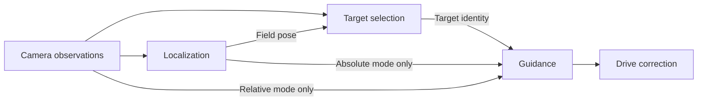

---
tags:
  - Advanced
---

# Drive Guidance

**Before this page:** read [field-relative drive](<../examples/Field-relative Drive.md>) and
[Spatial Queries](<Spatial Queries.md>) for heading, frames, and geometry evidence. This optional
guide adds a **drive correction**: for example, let the sticks move the robot while the software
turns it toward a target. An **overlay** replaces selected parts of the manual command, not its
hardware writer. Here **omega** names the turn component, positive counter-clockwise.

`DriveGuidance` is the drivetrain consumer of the shared spatial-query layer. It turns field/robot geometry into a `DriveSignal` overlay or autonomous task.

Use Drive Guidance when the **drivetrain** should correct translation, heading/facing, or both. Use [`Spatial Queries.md`](<Spatial Queries.md>) directly when you only want raw geometry. Use [`Mechanism Target Planning.md`](<Mechanism Target Planning.md>) when a **mechanism Plant** should move independently to a scalar target.

## Mental model

```text
SpatialQuery
    solves target vs control-frame geometry
        ↓
DriveGuidanceCore
    applies controllers to the chosen evidence
        ↓
DriveGuidanceStatus / DriveSignal
        ↓
Drive overlay, task, or telemetry gate
```

`DriveGuidancePlan` is a reusable behavior description: target, control frames, one explicit evidence mode, and drive tuning. `DriveGuidanceQuery` is the runtime source used for telemetry and readiness checks. Overlays, tasks, and queries use the same underlying evaluation logic.

## Guided builder shape

`DriveGuidance.plan()` and `PlantTargets.plan(request)` both answer required questions in order,
then enter optional tuning branches only when needed. Drive Guidance starts with a target-choice
stage; mechanism planning instead requires its fixed or live request at the factory boundary.

```text
DriveGuidance.plan()
    target question: choose the first channel with translateTo() or faceTo(), then optionally add the other with andFaceTo() or andTranslateTo()
    optional frame question: controlFrames(...)
    solve question: solveWith().absolutePose(...), relativeAprilTags(...), or observedPoints(...)
    optional tuning: driveTuning()
    build()
```

`build()` is not visible until at least one target and one solve strategy are chosen. Target choice methods such as `point(...)`, `fieldPointInches(...)`, and `frameHeading(...)` return to the parent stage immediately because they answer exactly one choice. Evidence modes receive their source directly; multi-setting branches end with `doneAbsolutePose()` or `doneRelativeAprilTags()`. The observed-point mode has one loss-policy answer and returns immediately.

## Common TeleOp pattern: button-held omega override

This example keeps driver translation from the sticks, but overrides omega while the button is held so a shooter frame faces a scoring point offset from an AprilTag.
The season-independent [framework examples index](<../examples/README.md>) places this advanced
policy after the managed drive and localization lessons; ordinary robot code keeps the guidance
plan in a robot-owned service and leaves the managed host responsible for loop and cleanup.

For field-relative aiming, first read the opening
[AprilTag localization model](<AprilTag Localization & Fixed Layouts.md>). Localization owns the
robot's estimated field position and direction; AprilTags may correct that estimate there. Guidance
reads the resulting pose, not a second camera-derived field pose. Here, pose evidence must be at
most `0.50 s` old with quality at least `0.10`. Quality is the producer's score, not a probability
that a shot succeeds. The proportional gain `aimKp(2.5)` converts angle error in radians into a turn
request; the `1°` deadband requests no correction near the goal. The default turn cap is `0.80`
normalized magnitude, and `OMEGA_ONLY` leaves manual translation alone. These are illustrative
software values, not reviewed physical settings.

```java
Pose2d robotToShooterFrame = new Pose2d(
        8.0,                  // shooter is 8" forward of robot center
        2.0,                  // and 2" left of robot center
        Math.toRadians(3.0)   // shooter +X points 3 deg left of robot +X
);

ReferencePoint2d scoringPoint = References.relativeToTagPoint(
        20,
        6.0,   // 6" forward from the tag frame
        -1.5   // 1.5" right from the tag frame
);

DriveGuidancePlan shooterAim = DriveGuidance.plan()
        .faceTo()
            .point(scoringPoint)
        .controlFrames(
                SpatialControlFrames.robotCenter()
                        .withFacingFrame(robotToShooterFrame)
        )
        .solveWith()
            .absolutePose(globalPoseEstimator)
            .maxAgeSec(0.50)
            .minQuality(0.10)
            .fixedAprilTagLayout(fixedTagLayout)
            .doneAbsolutePose()
        .driveTuning()
            .aimKp(2.5)
            .aimDeadbandRad(Math.toRadians(1.0))
            .doneDriveTuning()
        .build();

DriveSource drive = DriveOverlayStack.on(manualDrive)
        .add("shooterFacing", aimButton, shooterAim.overlay(), DriveOverlayMask.OMEGA_ONLY)
        .build();
```

The important separation is:

- `robotToShooterFrame` is the controlled frame that should face the target.
- The localization owner uses its own camera mount when interpreting AprilTag evidence.
- `scoringPoint` is the semantic target, here offset from tag 20.

The camera does not need to be centered or aligned with the shooter.

## Choose evidence explicitly

A **field pose** says where the robot is on the field. A **relative observation** says where a
visible tag was compared with the camera at capture. Both can aim at the same tag-relative point;
they answer it from different evidence.

| Mode | What guidance reads | When the camera is blocked |
| --- | --- | --- |
| `absolutePose(estimator)` | The admitted position and heading from the selected localizer | Continues only while that pose is usable |
| `relativeAprilTags(sensor, mount)` | Fresh geometry for the requested tag from that sensor | Unavailable without a fresh requested-tag observation |
| `observedPoints(lossPolicy)` | A selected object's robot-at-capture point | Follows that observation's explicit age limit |

Field guidance never bypasses rejected or delayed localization corrections with raw detections.
If close tags should have greater influence on field pose, configure and validate the localizer's
correction policy. Guidance neither retunes that policy nor blends two answers.

Direct tag alignment is also valid **when localization exists**: choose it deliberately when
the behavior is defined relative to the observed tag. Replace only the solve branch above:

```java
.solveWith()
    .relativeAprilTags(tagSensor, cameraMount)
    .maxAgeSec(0.25)
    .doneRelativeAprilTags()
```

No localizer or fixed field layout is required for that branch. It accepts tag-relative points
and frames, not a field-only point or heading. Another visible tag cannot secretly localize the
robot to solve an unseen requested tag. Relative geometry is delayed feedback at exposure, not
motion compensation.

Configured layouts, mounts, and tag offsets are computational facts; verify them physically.
There is no automatic fixture-displacement correction. A tag attached to a goal can define a
goal-relative offset; a tag merely near a goal needs a separately verified tag-to-goal relationship.

The ownership chain is:



In words: selection answers **which target**; localization answers **where the robot is**; guidance
answers **how to move using the chosen evidence**. The mode is explicit, not a fallback order.

## Runtime ownership and cycle safety

### Use an observed object or a computed approach

First [locate and select a vision target](<Vision Targets.md>). `selected` below is that existing
selection source, with its explicit capture-age limit. `robotToIntakeFrame` describes the measured
intake position and facing direction relative to the robot. It is not the camera mount.

```java
ReferencePoint2d point = References.observedPoint(selected);
DriveGuidancePlan aim = DriveGuidance.plan().faceTo().point(point)
        .controlFrames(SpatialControlFrames.robotCenter().withFacingFrame(robotToIntakeFrame))
        .solveWith().observedPoints(DriveGuidanceSpec.LossPolicy.PASS_THROUGH)
        .build();
DriveSource assistedDrive = DriveOverlayStack.on(manualDrive)
        .add("targetAim", aimButton, aim.overlay(), DriveOverlayMask.OMEGA_ONLY)
        .build();
```

`PASS_THROUGH` means the driver keeps control if the target is unavailable. With `OMEGA_ONLY`,
the overlay changes only turning while the button is held; driver translation remains unchanged.
The gain converts angle error in radians to a turn command; the deadband ignores small errors.
The unchanged tuning defaults include `aimKp = 2.5`, a `1°` deadband, and a normalized turn cap of
`0.80`; these are software values requiring bounded physical tuning, not safe starting powers.
Direct observation mode is delayed visual feedback in the robot frame **at capture**, not motion
compensation. Its age limit comes from `selected`; it accepts only observed-point targets.

A complete approach also chooses where the robot center should end up. **Stand-off** is the
remaining distance from the intake's origin to the target along intake +X. Suppose an observed ball
has field position `(20, 3)` inches. An intake at `(6, 1)` relative to the robot, facing forward,
with `2` inches of stand-off and desired field heading `0`, requires robot-center pose `(12, 2, 0)`.
Those numbers are illustrative geometry, not physical pickup settings.

```java
ApproachResult2d approach = ApproachResult2d.forTarget(
        target, robotToIntakeFrame, standOffInches, desiredFieldHeadingRad, maxTargetAgeSec);
ReferenceFrame2d goal = References.approachFrame(Source.constant(approach));
DriveGuidancePlan move = DriveGuidance.plan()
        .translateTo().point(References.framePoint(goal))
        .andFaceTo().frameHeading(goal)
        .solveWith().absolutePose(poseEstimator).doneAbsolutePose()
        .build();
```

`target` must have valid capture-time field coordinates. The other named values are explicit
robot configuration, and `poseEstimator` is the already updated localization source. The
absolute-pose branch accepts pose evidence no older than `0.50` seconds with quality at
least `0.10`. Set `maxAgeSec(...)` and `minQuality(...)` before `doneAbsolutePose()` to change those requirements. This snippet
constructs a plan; it does not start motion. Robot-center control frames are the default: do not
apply the intake offset again. This same plan can create an overlay, query, or fresh guidance
Task with the lifecycle described below.

For a tag-relative approach, existing `References.relativeToTagFrame(...)` and selected-tag
frames express an authored tag-local offset and heading. They already work with frame-point and
frame-heading guidance. When a robot policy computes a destination from located tag evidence,
`ApproachResult2d.observedFieldPose(...)` retains that evidence exactly as it does for an object.
Tags preserve orientation and identity; anonymous balls do not acquire those facts by analogy.

An observed approach expires with its sighting. Only an explicitly bounded call such as
`approach.committedFor(clock, attemptTimeoutSec)` freezes the destination for a resting-target
attempt, and it cannot extend itself by recommitting. The robot still owns rechecking the target
region, safe staging, loss behavior, capture feedback, cancellation, and limits on wall contact.
Guidance arrival is **not** capture confirmation. See
[one bounded vision pickup](<../examples/One Bounded Vision Pickup.md>) for that separate policy.

### Each consumer owns its runtime

`DriveGuidancePlan` is reusable configuration; each call to `overlay()`, `query()`, or
`task(driveSink, taskConfig)` creates fresh runtime state. These plan-owned methods are the public
construction paths for guidance runtimes. Give each overlay instance exactly one activation owner. In ordinary
robot code that means calling `plan.overlay()` once for each stack layer instead of retaining one
overlay and installing it in multiple layers or stacks:

```java
DriveSource drive = DriveOverlayStack.on(manualDrive)
        .add("shooterFacing", aimButton, shooterAim.overlay(), DriveOverlayMask.OMEGA_ONLY)
        .build();
```

The student-facing call is unchanged; cycle protection lives inside the framework. After a built
stack completes one evaluation, repeated reads in that cycle return the same command without
resampling its base, activation gates, or enabled overlays. A guidance runtime similarly advances
its controllers once. Failed evaluation is not cached as success, so a retry may
resample the graph instead of hiding the failure behind stale or null output; each stateful source
or overlay still protects its own advancing state for that retry.

An overlay-stack builder is single-use. After `build()`, do not add another layer or build another
stack from that builder. A stack also rejects the same overlay object in two layers because two
independent activation gates cannot truthfully own one overlay's enable/disable state. If two gates
mean one behavior, combine the gates; if they mean independent behaviors, create a fresh
`plan.overlay()` for each.

One guidance runtime also uses one requested `DriveOverlayMask` in a cycle. Equal same-cycle reads
return the same result. If two consumers need different masks, use the plan's natural/union mask or
create independent runtimes; asking one runtime for a second mask in that cycle fails fast instead
of advancing one controller state twice. `DriveGuidanceQuery.get(clock)` and `sample(clock)` use the
plan's natural mask, so ordinary readiness code needs no mask bookkeeping.

Overlay activation remains the stack's lifecycle: it calls `onEnable(clock)` and
`onDisable(clock)` exactly once per transition. There is intentionally no `DriveOverlay.reset()`
hook. Resetting a guidance query or re-enabling an overlay clears only that runtime's behavior and
query memory; it does not reset frame providers, solve lanes, sensors, estimators, or selected-tag
policies borrowed through the plan's reusable spatial spec. Those collaborators remain owned by
the robot services that supplied them.

An overlay's `PASS_THROUGH` loss policy masks only solved, requested components. `ZERO_OUTPUT`
instead masks all requested components and writes zero for missing ones; it does not mark those
components solved. This is an overlay choice, not an autonomous permission to move with partial
evidence. Inspect the solved flags and Task outcome to distinguish arrival from failure.

## Controller tuning

A **controller** converts the difference between the desired and observed state into a command.
The proportional gain `kP` multiplies that difference: a larger error asks for a larger correction,
up to the command cap. A deadband asks for zero correction near the goal to avoid reacting to tiny
errors. These terms describe this guidance controller; they do not establish safe physical tuning.

`DriveGuidancePlan.Tuning` is an immutable, reusable description of how spatial error becomes a
normalized drive command. Start from `Tuning.defaults()` when robot code stores or shares the
complete value. Use the `driveTuning()` branch, as in the example above, when the answers belong
only to one plan. Both paths construct the same validated value; neither is live tuning.

| Setting | Default | Meaning | Required software domain |
| --- | ---: | --- | --- |
| `kPTranslate` | `0.05` | normalized command per inch of translation error | finite and `>= 0` |
| `maxTranslateCmd` | `0.60` | maximum normalized translation-command magnitude | finite in `[0, 1]` |
| `kPAim` | `2.50` | normalized omega command per radian of aim error | finite and `>= 0` |
| `maxOmegaCmd` | `0.80` | maximum normalized omega-command magnitude | finite in `[0, 1]` |
| `minOmegaCmd` | `0.00` | minimum normalized omega command outside the deadband | finite in `[0, maxOmegaCmd]`; a positive value also requires positive `kPAim` |
| `aimDeadbandRad` | `Math.toRadians(1.0)` | wrapped aim error that produces zero omega | finite in `[0, Math.PI]` |

Zero gains or command caps can deliberately disable their channel. Zero minimum omega disables the
stiction assist, while a deadband of pi suppresses every canonical wrapped aim error. Every immutable
intermediate must be coherent, so when reducing both nonzero omega limits, reduce `minOmegaCmd`
before reducing `maxOmegaCmd` below the old minimum.

For a positive cap, the translation controller preserves the direction of a finite error vector.
It enforces every accepted normalized cap, including zero and very small positive values, and
recovers that finite-error direction when multiplication by a very large finite gain would otherwise
overflow. This software bound does not prove that the defaults—or any other accepted values—are
physically safe or well tuned for a drivetrain. Validate direction, response, and safe limits on the
actual robot before relying on an assist.

## Autonomous Task configuration

`DriveGuidanceTask.Config` is a mutable construction input, not a live-tuning handle. A direct
`plan.task(driveSink, config)` call validates the complete input and retains a private snapshot
before it returns. Changing the same `config` afterward cannot change that Task; the new values are
used only by a later Task constructed from the edited input.

The task-level settings are separate from the controller tuning stored in the plan:

| Setting | Default | Required software domain |
| --- | ---: | --- |
| `positionTolInches` | `1.5` | finite and `>= 0` |
| `headingTolRad` | `Math.toRadians(6.0)` | finite and `>= 0` |
| `timeoutSec` | `3.0` | finite and `> 0` |
| `maxNoGuidanceSec` | `0.35` | finite and `> 0` |

`positionTolInches` and `headingTolRad` decide when the requested translation and facing work is
complete. `timeoutSec` bounds the complete Task; `maxNoGuidanceSec` bounds one consecutive interval
without all requested channels having finite solved errors. A zero motor command is not proof
of a solution: it may mean arrival, a configured zero gain, or missing evidence. During missing or
partial evidence the Task immediately stops active guidance, clears old errors, and runs its loss
timer, even if the overlay loss policy is `ZERO_OUTPUT`. Zero, a negative value, `NaN`, or infinity is not a spelling for
disabling either timeout. If `requestedMask` is `null`, the Task uses the plan's natural mask.

These checks prove only that the software configuration is coherent. They do not prove that the
tolerances or time budgets are appropriate for a particular drivetrain, that guidance is tuned
safely, or that the robot will physically reach its target.

A guidance Task advances once per shared clock cycle; its first update may share its start cycle,
and repeated or active recursive updates do not issue another command. Its Task budget starts at
that Task's start time, while the consecutive no-guidance timer starts when usable guidance is
lost. Each deadline expires when elapsed time is greater than its configured limit. Success,
timeout, active cancellation and an armed lifecycle failure all attempt the owned drive-stop path.
Stopping here ends this drive command lifetime, not the robot's broader service ownership.

A lifecycle or ending `RuntimeException` remains a failure: later Task updates and outcome reads
rethrow it rather than publishing successful arrival or ordinary cancellation. This effectful Task
contract differs from a retryable query/value observation described above. It does not retry a
possibly executed drive command. The robot still owns whether to retry with a fresh Task, fall
back, or abort; software terminality is not evidence that the chassis physically stopped.

## Known-clear rectangular parking assist

A robot-owned parking assist can reuse the ordinary field-relative Go-to-Pose Task. It must own an
explicit target translation and one or more reviewed target headings; the framework does not derive
a target or collision-free route from the parking box.

For one required orientation, put that heading directly in the target `Pose2d`. When several
orientations are acceptable, choose the nearest one exactly once from a usable current pose and
freeze it into the Task's target:

```java
double selectedHeadingRad = SpatialMath2d.nearestHeadingRad(
        fieldToRobot.headingRad,
        PARK_HEADINGS_RAD
);
Pose2d parkTarget = new Pose2d(PARK_X_INCHES, PARK_Y_INCHES, selectedHeadingRad);

Task parkTask = GoToPoseTasks.goToPoseFieldRelative(
        poseEstimator,
        drivebase,
        parkTarget,
        driveTuning,
        taskConfig
);
```

The ordered heading list belongs to the robot's configuration and must be defensively copied. Before
constructing hardware or behavior owners, check every complete candidate pose at the reviewed target
translation with a conservative `RobotFrameRectangle2d` and the authored
`AxisAlignedBoxRegion2d`; reject the configuration if any candidate is not
`rectangle.fullyInside(box, candidatePose)`. An off-center tracked origin uses
`RobotFrameRectangle2d.fromRobotFrameBoundsInches(...)` rather than pretending the origin is the
rectangle center.

Do not reselect the heading each loop near a tie. If the current pose is unavailable or non-finite,
do not start automatic motion; report the assist as unavailable and leave manual drive available.
`fullyInside(...)` reports only whether all four modeled corners are inside or on the box at that
instant. `hasAnyCornerInside(...)` answers only its literal corner question: it is not a general
overlap test and neither predicate proves support, collision clearance, occupancy, legality, or an
official score.

Use this assist only for a designated known-clear box with conservative pose and physical clearance.
A shared or partially occupied box remains a manual driver decision. The final-pose check does not
prove that the robot can turn or drive there without sweeping outside the clear area.

## Readiness / telemetry query

A plan can create a runtime query for “are we ready?” checks:

```java
DriveGuidanceQuery shooterAimQuery = shooterAim.query();

DriveGuidanceStatus status = shooterAimQuery.get(clock);
boolean readyToShoot = status.omegaWithin(Math.toRadians(1.0));

telemetry.addData("shooterFacing.errorDeg", Math.toDegrees(status.omegaErrorRad));
telemetry.addData("shooterFacing.ready", readyToShoot);
telemetry.addData("shooterFacing.evidence", status.solveMode);
```

`DriveGuidanceQuery` implements `Source<DriveGuidanceStatus>`, so it fits the Sushi source graph.
Create one query per independent owner because each query owns its cycle cache, controller
state, and explicit reset lifecycle. The plan and its robot-owned spatial dependencies may still be
shared safely.

## Translation + facing

A plan can solve translation, facing, or both. Start with the first channel, then add the second with `andFaceTo()` or `andTranslateTo()`:

```java
DriveGuidancePlan alignToSlot = DriveGuidance.plan()
        .translateTo()
            .point(References.framePoint(slotFrame, -6.0, 0.0))
        .andFaceTo()
            .frameHeading(slotFrame)
        .controlFrames(SpatialControlFrames.robotCenter())
        .solveWith()
            .absolutePose(globalPoseEstimator)
            .fixedAprilTagLayout(tagLayout)
            .doneAbsolutePose()
        .build();
```

The translation frame and facing frame may differ:

```java
SpatialControlFrames frames = SpatialControlFrames.robotCenter()
        .withTranslationFrame(robotToIntakePoint)
        .withFacingFrame(robotToShooterFrame);
```

## Relationship to `SpatialQuery`

Drive Guidance uses `SpatialQuery` internally. The same concepts are shared with mechanism planners:

```text
faceTo(...)
translateTo(...)
controlFrames(...)
solveWith(...)
fixedAprilTagLayout(...)
```

The output boundary is different:

- Drive Guidance maps spatial results to drivetrain `DriveSignal` commands.
- Mechanism Target Planning maps requests to caller-facing Plant-unit targets.

The framework keeps this difference because a drivetrain command domain is known, but a mechanism may use ticks, inches, servo positions, rotations, or another scalar coordinate.

## Complete example: approach a visible tag

The independent
[`TagAlignment`](<https://harishv-99.github.io/2025-PhoenixPedro/api/edu/ftcsushi/robots/examples/tagalignment/TagAlignment.html>)
example uses only a webcam and drivetrain. It teaches direct tag-relative approach, not field
localization, obstacle avoidance, or multi-zone strategy. A frame gives both the destination point
and its direction. Its draft asks the robot center to stop 18 inches outward from tag 1 and face
back toward it (`Math.PI` radians); these are illustrative values to replace in
[`TagAlignmentProfile`](<https://harishv-99.github.io/2025-PhoenixPedro/api/edu/ftcsushi/robots/examples/tagalignment/TagAlignmentProfile.html>).

The plan's evidence branch is the same whether a held button or a Task consumes it:

```java
.solveWith().relativeAprilTags(tags, mount)
.maxAgeSec(profile.maxTagAgeSec)
.onLoss(DriveGuidanceSpec.LossPolicy.PASS_THROUGH)
.doneRelativeAprilTags()
```

The complete managed TeleOp wiring registers the camera owner first, then the one drive path:

```java
TagAlignmentCamera camera = program.service(new TagAlignmentCamera(hardwareMap, profile.camera));
AprilTagVision tags = camera.tags();
DriveGuidancePlan plan = TagAlignment.plan(profile, tags.tagSensor(), tags.cameraMountConfig());
TagAlignmentControls controls = new TagAlignmentControls(new GamepadDevice(gamepad1), plan);
program.drive(controls.driveSource(), FtcDrives.mecanum(hardwareMap, profile.drive));
```

The camera service owns cleanup; guidance borrows its observation view. Holding the left bumper
enables the full position-and-heading overlay; release restores manual control. With missing
evidence, `PASS_THROUGH` leaves the missing channels manual; a fresh observation can resume the
assist while held. Telemetry reports that distinction from the actual sampled overlay.
Auto constructs one fresh `plan.task(drive.sink, profile.auto)` for `program.rootTask(...)`.
Its registered drive service owns stop but writes no idle command over the Task.

The draft rejects tag frames older than `0.20 s`, caps guidance translation and turn at `0.20`,
and uses a `5 s` Task budget with `0.30 s` consecutive-loss limit. Arrival tolerances are `1 in`
and `3°`. These are software example values, not physical safety or tuning evidence.

**Complete source:** [`TagAlignment.java`](<https://github.com/harishv-99/2025-PhoenixPedro/blob/master/TeamCode/src/main/java/edu/ftcsushi/robots/examples/tagalignment/TagAlignment.java>),
[`TagAlignmentProfile.java`](<https://github.com/harishv-99/2025-PhoenixPedro/blob/master/TeamCode/src/main/java/edu/ftcsushi/robots/examples/tagalignment/TagAlignmentProfile.java>),
[`TagAlignmentCamera.java`](<https://github.com/harishv-99/2025-PhoenixPedro/blob/master/TeamCode/src/main/java/edu/ftcsushi/robots/examples/tagalignment/TagAlignmentCamera.java>),
[`TagAlignmentControls.java`](<https://github.com/harishv-99/2025-PhoenixPedro/blob/master/TeamCode/src/main/java/edu/ftcsushi/robots/examples/tagalignment/TagAlignmentControls.java>),
[`TagAlignmentTeleOp.java`](<https://github.com/harishv-99/2025-PhoenixPedro/blob/master/TeamCode/src/main/java/edu/ftcsushi/robots/examples/tagalignment/TagAlignmentTeleOp.java>),
[`TagAlignmentAuto.java`](<https://github.com/harishv-99/2025-PhoenixPedro/blob/master/TeamCode/src/main/java/edu/ftcsushi/robots/examples/tagalignment/TagAlignmentAuto.java>), and
[software checks](<../../../../../../../test/java/edu/ftcsushi/robots/examples/tagalignment/TagAlignmentTest.java>).
The supplied checks author tag frames and keep the real plan, overlay, and Task. They check mount
geometry, manual handoff, stale-frame timeout, cancellation, and fresh-task reuse; they do not
prove camera accuracy or physical stopping distance.

Both Driver Station programs (`FW Direct Tag Align`, `FW Direct Tag Align Auto`) have `@Disabled`,
and the profile additionally requires `allowMotion = true` before hardware construction. Before
enabling either, review wiring, detector ID/printed size, mount, directions, clearance, and command
limits; verify geometry without motion and use supervised low-speed trials with FTC STOP available.
A correct tag-relative destination alone does not establish a clear approach path.

## Dynamic camera mounts

For a fixed webcam or fixed Limelight, pass a fixed `CameraMountConfig`:

```java
.solveWith()
    .relativeAprilTags(tagSensor, fixedCameraMount)
    .maxAgeSec(0.25)
    .doneRelativeAprilTags()
```

For field guidance with a moving camera, supply its capture-time mount history to the
`AprilTagPoseEstimator` constructor, then use `absolutePose(...)`. For advanced direct geometry,
pass a timestamp-aware source through
`SpatialSolveSet.builder().relativeAprilTags(...)`; see [`Spatial Queries.md`](<Spatial Queries.md>) and
[`Mechanism Target Planning.md`](<Mechanism Target Planning.md>). This lets the AprilTag lane
interpret delayed camera frames using the camera pose from the frame timestamp. Sushi carries that
capture time as one `LoopTimestamp`, so camera, frame-history, spatial, and guidance code do not
separately pass or compare a raw clock epoch and timestamp.

## Control frames and off-center facing

`SpatialControlFrames.withFacingFrame(...)` describes the frame whose +X axis should face the target. For a rigid shooter, this is often a fixed robot-relative pose. For a turret driven by its own Plant, this is usually the turret tool zero frame, not the camera frame.

```java
Pose2d robotToTurretToolZero = new Pose2d(
        7.0,
        2.5,
        Math.toRadians(10.0)
);
```

Meaning:

- the turret pivot/tool frame is 7" forward and 2.5" left of robot center
- when the turret mechanism coordinate is zero, its tool +X points 10° left of robot forward

For a turret with its own Plant, do not use Drive Guidance to turn the robot. Use `SpatialQuery`
plus `PlantTargets.equivalentPositionsOf(...)` for one current logical angle, or the advanced
`PlantTargets.plan(request)` path when alternative/observation metadata must be retained, as shown in
[`Mechanism Target Planning.md`](<Mechanism Target Planning.md>).

## When not to use Drive Guidance

Use a direct `DriveSource` when the driver or autonomous routine already knows the desired drive
command. Use an exact/equivalent `PlantTargetResolver` or advanced `PlantTargets.plan(request)` when a
mechanism should move independently of the drivetrain. Use `SpatialQuery` directly when you need
geometry but want to apply your own PID or mechanism logic.
