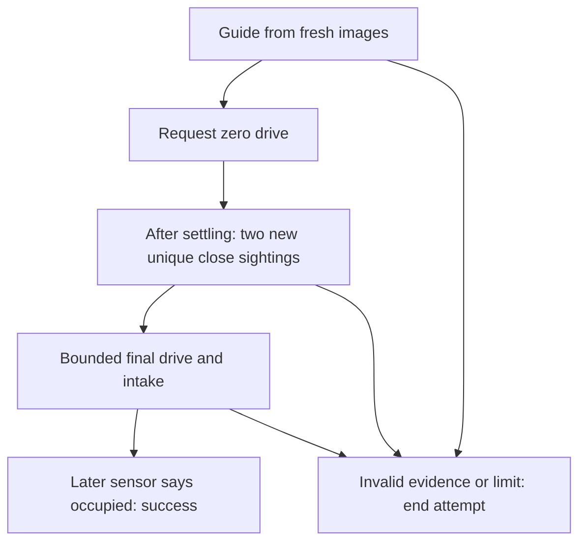

---
tags:
  - Advanced
---

# Pick up one ball without localization

**Outcome:** explain and wire one bounded camera-only pickup, including why a hidden ball is not
automatically a captured ball. **Before this page:** [locate a vision target](<../drive-vision/Vision Targets.md>),
[shared drive guidance](<../drive-vision/Drive Guidance.md>), and
[combine drive and intake](<../build/Combine Drive and Intake.md>). Those pages introduce located
camera points, drive commands, and one managed output path. The
[Task lesson](<../getting-started/learn-sushi/Tasks and Autonomous.md>) explains work across loops.
Reading and the software checkpoint need no robot. Physical adoption needs a calibrated fixed
webcam, mecanum drive, an intake, and an independent occupied/empty sensor.

## Let sight authorize the short final maneuver

A ball may disappear beneath the intake before it reaches the sensor. If the robot stopped at
every such disappearance, pickup would fail. If disappearance itself started intake motion, a
blocked camera could send the robot forward without a target.

This example allows the final maneuver **while the ball is still visible**. First it guides toward
the ball. Near the intake, it requests zero drive and checks two newer images. Each image must show
the selected candidate close and aligned, with exactly one candidate in that same small window.
Only then may it drive straight briefly with the intake running. This is **verification** of
available camera evidence, not proof that the chassis physically stopped or that two patches are
the same physical ball.



Repeated reads of one image do not count as two images. An ambiguous window, a missing position,
or losing the ball before verification finishes ends the attempt; it does not secretly start
blind motion. Both verification captures must still be fresh when authorizing the final phase.
During final intake, camera loss is allowed, but sensor loss is not. Release,
override, STOP, or an expired limit can end any active phase. Normal ending gives the driver back
the manual source; stopping the OpMode separately stops the real outputs.

## Put the behavior in a robot capability

[`GuidedApproach`](<https://harishv-99.github.io/2025-PhoenixPedro/api/edu/ftcsushi/fw/drive/guidance/GuidedApproach.html>)
is the framework owner of these phases. The independent robot capability
[`CameraOnlyPickup`](<https://harishv-99.github.io/2025-PhoenixPedro/api/edu/ftcsushi/robots/examples/cameraonlypickup/CameraOnlyPickup.html>)
chooses the nearest visible object and supplies the robot's configuration. It owns one approach
for its whole lifetime, not one per loop. It creates a fresh Task for each request.

**Stand-off** means how far the ball should remain ahead of the intake when verification begins.
This profile places the intake three inches forward of robot center and chooses a five-inch
stand-off. With the intake facing straight forward, a point eight inches ahead of robot center
has zero approach error. That does not mean the ball is already inside the intake.

The following exact excerpt is constructed once inside the capability. `config` is the profile
whose active values are listed below. Each chained method answers one question; `withinSec(...)`
finishes construction. It does not start moving.

```java
approach = GuidedApproach.cameraOnly(selected)
        .throughTool(config.robotToIntake, config.standOffInches)
        .driveTuning(config.tuning)
        .verifyWithZeroCommand(config.settleSec, config.positionToleranceInches,
                config.headingToleranceRad, config.verificationTimeoutSec)
        .finalIntake(setCollecting, config.finalCommand, config.maxFinalSec)
        .captureFeedback(occupancy, config.maxCaptureAgeSec)
        .idleFrom(idleDrive)
        .withinSec(config.maxAttemptSec);
```

`setCollecting` is the saved intake method: `true` requests collection and `false` requests stopped
intake through that mechanism's normal Plant. Final entry calls it once with `true`; the request
persists without being rewritten each loop. After that claim, ending calls it once with `false`.
The example gives no other behavior a competing intake request during the attempt. `occupancy`
is separate sensor evidence.
[`OccupancyObservation`](<https://harishv-99.github.io/2025-PhoenixPedro/api/edu/ftcsushi/fw/sensing/observation/OccupancyObservation.html>)
means one occupied/empty reading with its original time. `Source<OccupancyObservation>` means an
object returning that value when sampled with the shared clock. Unavailable is not empty. The
same value is used by the localized pickup example; neither path infers capture from a motor command.

`idleDrive` is manual stick input for TeleOp and zero for Auto. While an attempt runs, its Task
advances the guidance query and selects drive intent. Reading `driveSource()` or `status()` never
advances a phase. There is no second drive sink or hidden localization owner.

### Make all active answers visible

[`CameraOnlyPickupProfile`](<https://harishv-99.github.io/2025-PhoenixPedro/api/edu/ftcsushi/robots/examples/cameraonlypickup/CameraOnlyPickupProfile.html>)
is a data-only authoring draft. Change the named field there; active owners copy the values they
consume, so changing the draft after construction is not live tuning. These are **illustrative
software values**, not approved physical settings.

| Profile answer | Value and meaning |
| --- | --- |
| `allowMotion` | `false`; the supplied OpMode fails before acquiring devices until reviewed |
| `robotToIntake`, `standOffInches` | `(3,0,0)` inches/radians; stand-off `5` inches along intake +X |
| `maxObservationAgeSec` | `0.20` seconds from original camera capture |
| `tuning` | Translation gain `0.05` command/inch, turn gain `2.5` command/radian; caps `0.20` each; turn deadband `1°`, minimum turn command `0` |
| `settleSec`, `verificationTimeoutSec` | `0.10` seconds at zero command, then two newer qualifying frames within the full `0.60`-second verification phase |
| `positionToleranceInches`, `headingToleranceRad` | `0.50` inches approach error and `Math.toRadians(5)` facing error |
| `finalCommand`, `maxFinalSec` | `0.10` normalized translation for at most `0.50` seconds, along intake +X; zero turn command |
| `maxCaptureAgeSec`, `maxAttemptSec` | Sensor age at most `0.10` seconds; whole attempt at most `3.0` seconds |

The geometry uses robot +X forward, +Y left, and counter-clockwise positive angles. Positive camera
pitch rotates its forward direction downward. The physical part of the same draft is:

| Wiring/configuration | Value and where to change it |
| --- | --- |
| Drive motor names | `drive.wiring.frontLeftName`, `frontRightName`, `backLeftName`, `backRightName`: `frontLeftMotor`, `frontRightMotor`, `backLeftMotor`, `backRightMotor` |
| Drive direction and caps | Corresponding `...Direction` fields: left `FORWARD`, right `REVERSE`; `enableZeroPowerBrake=true`; `drive.drivebase.maxAxial/maxLateral=0.25`, `maxOmega=0.20` |
| Intake | `intake.motorName="intakeMotor"`, `direction=FORWARD`, `collectPower=0.20` |
| Occupancy sensor | `intake.occupancySwitchName="intakeOccupied"`; active-low wiring means LOW is occupied; no debounce in this example |
| Webcam | `camera.webcamName="Webcam 1"`, default `cameraResolution` of `640 × 480`; valid SDK calibration must match |
| Fixed mount | `camera.cameraMount`: `(4,0,10)` inches and yaw/pitch/roll `(0,45°,0)` converted to radians |
| Target model | `camera.floorObjects.targetModel`: modeled point height `2` inches, maximum camera-to-point line-of-sight range `48` inches |
| Color filtering | `camera.floorObjects`: `minY/maxY=32/255`, `minCr/maxCr=128/170`, `minCb/maxCb=0/120`; `minContourAreaPixels=0`, `blurSizePixels=0` |
| Frame limits | `camera.floorObjects.maxFrameAgeSec=0.25`, `maxCandidates=16`; selector's `0.20` age limit is stricter; excess candidates reject the frame |

The vision prerequisite explains the YCrCb color channels and height assumption. A valid color
threshold is not recognition of a particular ball. Zero area/blur settings mean no additional area
filter or smoothing. No AprilTag processor is configured, and no field pose is used. Camera and
intake geometry remain fixed throughout this capability's lifetime; stop it before changing the
camera configuration and construct a fresh graph afterward.

## Connect one managed TeleOp graph

[`CameraOnlyPickupTeleOp`](<https://harishv-99.github.io/2025-PhoenixPedro/api/edu/ftcsushi/robots/examples/cameraonlypickup/CameraOnlyPickupTeleOp.html>)
is deliberately marked `@Disabled`, so it does not appear in the Driver Station list. Its
`configure(program)` first constructs the profile and calls `profile.requireMotionAllowed()`.
Even removing `@Disabled` does not bypass the profile's separate physical-review gate.
That gate also rejects shared drive/intake motor names (ignoring surrounding spaces) before any
device is acquired: separate owners must not command the same motor. Distinct names cannot detect
different configuration aliases for one physical device; check the actual wiring separately.

After that gate, the important setup connections are:

```java
CameraOnlyPickupCamera camera = program.service(new CameraOnlyPickupCamera(hardwareMap, profile.camera));
CameraOnlyPickupIntake intake = program.output(new CameraOnlyPickupIntake(hardwareMap, profile.intake));
GamepadDevice driver = new GamepadDevice(gamepad1);
DriveSource manualDrive = manualDrive(driver);
CameraOnlyPickup pickup = program.service(new CameraOnlyPickup(profile,
        camera.objects(), intake.occupancy(), intake::setCollecting, manualDrive));
CameraOnlyPickupControls controls = new CameraOnlyPickupControls(driver.rightBumper(), driver.b());
controls.bind(program.callbackBindings(), program.taskBindings(), pickup);
program.drive(pickup.driveSource(), FtcDrives.mecanum(hardwareMap, profile.drive));
```

`intake::setCollecting` saves that method for later; it does not run during setup. `bind(...)`
registers behavior for later loop input changes, synchronously in that loop, not on another thread.
Right bumper press queues one fresh attempt. Holding keeps permission; release or B cancels it.
An old queued press stays revoked even if the button is pressed again. A press while B is held is
ignored, and releasing B alone does not request another attempt. Repress deliberately to retry.

`manualDrive(driver)` constructs the robot-centric `GamepadDriveSource` from left X/Y and right X.
Its source configuration is explicit in the host: device deadband `0.02`, drive deadband `0.05`,
translation/rotation exponents `1.5`, and scales `1.0`. A deadband ignores small centered-stick
values; an exponent softens response near center. The final drive caps in the profile still apply.
No localization is required for manual control after a failed attempt.

The program advances its one clock, then Services, Bindings, Tasks, Outputs/Drive, and Presenters.
The camera service owns camera close; its object source samples lazily when the Task asks. Pickup's
service owns terminal cleanup but adds no second update of its Task. Intake owns the one Plant and
its downstream update/stop. Its active-low input is read once per sampled cycle and stamped at
that actual read; it never copies the motor command into sensor feedback. The example requires a
sensor with a validated stable occupied/empty meaning, not an unconditioned bouncing contact.

The host's presenter adds `phase`, `outcome`, `reason`, and verified-frame count to the program's
one telemetry frame. It reads cached status, never resamples a camera. `SUCCESS`, `CANCELLED`,
`TIMEOUT`, and exceptional `FAILED` are visibly different; “not moving” alone is not the outcome.
STOP cancels Tasks, stops intake/drive outputs, and stops services in reverse registration order,
so the dependent pickup ends before camera close. A lifecycle exception keeps its failure; it is
not converted to ordinary cancellation or permission to continue Auto.

An Auto client uses the same capability with a zero idle source and no TeleOp bindings:

```java
program.rootTask(pickup.createPickupTask(clock -> true));
```

Here `clock -> true` grants admission/continued permission whenever sampled; ordinary cancellation
and deadlines still apply. Construct `pickup` with `clock -> DriveSignal.zero()` in place of
`manualDrive`, keep the same intake/camera ownership and one `program.drive(...)`, and declare one
root Task. There is no automatic repetition. A later ordinary Task sequence continues only after
confirmed `SUCCESS`; capacity, search, region choice, and retries belong to explicit robot policy.

## Check the sequence without pretending to simulate motion

**Question:** can the real example continue through expected final camera occlusion without calling
it a capture? **Keep real:** profile, capability, core approach/query, controls, Task runner, intake
semantic setter, and Plant. **Replace:** webcam frames, gamepad meanings, and actual devices with
scripted observations and software motor/switch probes. **Observe:** phase, recorded commands,
sensor readings, and exact Task outcome. **Cannot conclude:** physical camera visibility, braking,
travel, recognition, or capture.

The supplied `visibleVerificationAllowsBlindFinalButOnlyTheSensorConfirmsCapture` checkpoint has
this authored timeline. The injected positions are not the result of a simulated moving robot.

| Time (seconds) | Injected evidence | Expected software result |
| --- | --- | --- |
| `0.02` | Empty intake; ball point `14` inches forward; pickup held | GUIDE, no capture |
| `0.04` | New ball point `8` inches forward | VERIFY and zero drive command |
| `0.15` | First newer qualifying point at `8` inches, after settling | One verification frame; no final intake yet |
| `0.17` | Second distinct qualifying frame; intake still empty | FINAL_INTAKE, command `0.10` and intake power `0.20`; still not success |
| `0.19` | Camera unavailable; sensor still empty | Final continues within its bounds; still not success |
| `0.21` | New independent occupied sensor reading | SUCCESS and stopped intake request |

**Read the causal chain:** visible evidence authorizes the final phase; camera disappearance changes
no capture fact; the later empty-to-occupied sensor transition alone confirms capture. **Proves:**
the tested software ordering and intent path. **Does not prove:** the authored positions occur on
hardware or that the robot physically stops within a distance. **Next gate:** supervised adoption.

**Complete source:** [profile](<../../../robots/examples/cameraonlypickup/CameraOnlyPickupProfile.java>),
[capability/service](<../../../robots/examples/cameraonlypickup/CameraOnlyPickup.java>),
[controls](<../../../robots/examples/cameraonlypickup/CameraOnlyPickupControls.java>),
[camera owner](<../../../robots/examples/cameraonlypickup/CameraOnlyPickupCamera.java>),
[intake mechanism](<../../../robots/examples/cameraonlypickup/CameraOnlyPickupIntake.java>), and
[disabled TeleOp](<../../../robots/examples/cameraonlypickup/CameraOnlyPickupTeleOp.java>).
**Complete test source:** [reading checkpoint](<../../../../../../../test/java/edu/ftcsushi/robots/examples/cameraonlypickup/CameraOnlyPickupSoftwareScenarioTest.java>),
[outside-world fixture](<../../../../../../../test/java/edu/ftcsushi/robots/examples/cameraonlypickup/CameraOnlyPickupTestRig.java>),
[controls/lifetime cases](<../../../../../../../test/java/edu/ftcsushi/robots/examples/cameraonlypickup/CameraOnlyPickupControlsTest.java>),
and [independent sensor/Plant checks](<../../../../../../../test/java/edu/ftcsushi/robots/examples/cameraonlypickup/CameraOnlyPickupIntakeTest.java>).
The [full verification command](<../maintainers/Maintainer Notes.md#16-automated-framework-verification>)
includes these supplied tests; running them is optional for understanding this page.

## Keep the physical gate separate

Before enabling an adopted OpMode, independently verify camera calibration, mount, modeled height,
color rejection and latency; ensure the target remains visible through the verification window.
Verify occupied/empty meaning without echoing commands, and drive/intake direction and emergency
STOP with motion isolated. Then validate tuning and the final command/time budget under supervised,
known-clear open-floor conditions with an operator ready to release or STOP. These values cannot
be certified for an unknown robot by a unit test.

Command and elapsed-time caps do **not** measure distance, prove physical rest, enforce walls, or
avoid obstacles. Use the separate [localized wall/corner pickup](<One Bounded Vision Pickup.md>)
when that explicit geometry and policy is needed; it is not secretly provided by this camera-only
routine. The next choice is to inspect the checkpoint or validate one physical fact at a time,
keeping automatic motion disabled until the adopting robot's review is complete.
