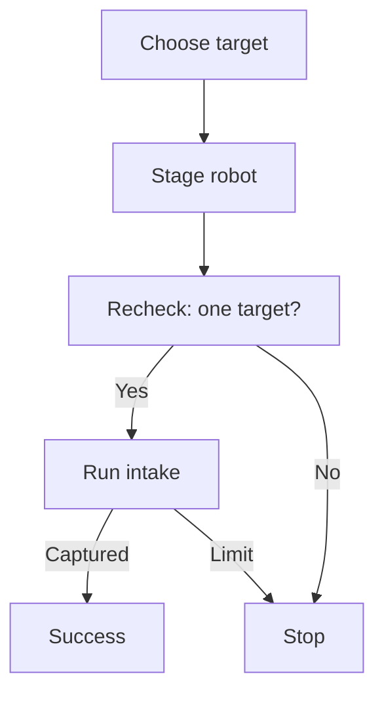

---
tags:
  - Advanced
---

# One bounded vision pickup

**Outcome:** turn one selected resting target into one cancellable attempt, and distinguish arrival
from capture. **Before this page:** [locate a vision target](<../drive-vision/Vision Targets.md>),
[use shared guidance](<../drive-vision/Drive Guidance.md#use-an-observed-object-or-a-computed-approach>),
and [combine drive and intake](<../build/Combine Drive and Intake.md>). For Auto composition,
[Tasks and autonomous](<../getting-started/learn-sushi/Tasks and Autonomous.md>) explains work that
continues across loops. This independent example does not require Pedro or a production robot.

## Reaching a destination is not capturing a ball

An **approach pose** is the desired position and heading of the robot center, computed before
moving. Reaching that destination does not prove the ball entered the intake. A sensor on the
intake must separately establish **capture**.
Starting the intake, reaching a pose tolerance, or running out of time does not prove capture.

[`VisionPickup`](<https://harishv-99.github.io/2025-PhoenixPedro/api/edu/ftcsushi/robots/examples/visionpickup/VisionPickup.html>)
is a robot-owned example policy, not a universal camera command. Its behavior has four visible
steps. A **bounded attempt** has explicit time, motion-command, and observed-travel limits; it
does not keep searching or retry until something works.



The staging pose is frozen for this one attempt so a new frame cannot silently redirect the robot
to another ball. At staging, a **recheck** requires a newer image with exactly one eligible
candidate inside the configured neighborhood of the frozen point. A nearby candidate is a
geometric association, not a proven identity. Zero candidates means lost; two means ambiguous.
Both stop the attempt. Only after the recheck does the final intake stage allow **occlusion**:
the expected loss of camera view when the robot or intake hides the ball.
“Captured” in the drawing requires a new accepted capture-sensor transition, not image
disappearance. Cancellation, invalid evidence, and the configured bounds can stop any active
stage; the limits are not restricted to the one arrow shown.

## Share one action between TeleOp and Auto

This example is deliberately hardware-neutral. The adopting robot supplies its existing
localization owner, capture-feedback source, intake setter, manual drive source, and final sink.
`selected` must read the live capture-time field-projection path from the vision lesson. A cached
field point from before a localization reset is not a valid replacement.

The essential composition-root connections are:

```java
VisionPickup pickup = program.service(new VisionPickup(
        reviewedConfig, selected, localization, captureFeedback,
        intake::setCollecting, manualDrive));
VisionPickupControls controls = new VisionPickupControls(aimHeld, pickupHeld, driverOverride);
controls.bind(program.callbackBindings(), program.taskBindings(), pickup);
program.drive(pickup.driveSource(), driveSink);
```

`intake::setCollecting` saves the mechanism's method for later: `true` requests collection, `false`
requests stopped intake. It must change that mechanism's intent, not bypass its Plant with a
hardware write. The mechanism retains its own output update and physical STOP. The angle-bracket
type `Source<VisionPickup.CaptureFeedback>` supplies timestamped sensor observations through
`VisionPickup.CaptureFeedback.observed(occupied, timestamp)` or the explicitly missing value
`VisionPickup.CaptureFeedback.unavailable()`. It must not echo the intake command as if that were
sensor feedback.

[`VisionPickupControls`](<https://harishv-99.github.io/2025-PhoenixPedro/api/edu/ftcsushi/robots/examples/visionpickup/VisionPickupControls.html>)
assigns three operator meanings. Holding aim enables heading assistance while the driver's
translation remains intact. Pressing pickup creates one fresh Task. Releasing pickup or asserting
driver override cancels it, including rejecting permission for a request still queued at start.
Define `driverOverride` from your robot's explicit operator policy—for example, a cancel button or
a reviewed stick threshold. Do not assume a universal FTC control mapping.

An Auto client uses the same factory instead of the TeleOp button bindings:

```java
program.rootTask(pickup.createPickupTask(clock -> true));
```

`clock -> true` is a small function that always grants Auto permission when sampled; it does not
disable Task cancellation or any limit. Auto supplies a zero idle drive source in place of manual
sticks. Keep one `program.drive(...)` declaration in either mode. Pickup Tasks select private drive
intent; they do not create another sink or write around the managed drive output. A fresh Task is
required for each attempt. Ordinary task sequencing continues on `SUCCESS`, not an unconfirmed
`UNKNOWN` result.

Declare the camera/localization/history services first, then this service. Declare the intake's
normal output and the one drive output. The relevant managed order is:

`Clock → camera/localization/history Services → pickup Service → Bindings → Tasks → intake/drive Outputs → Presenters`

Services consume the one clock; none advances it. Held-aim changes made by Bindings are evaluated
by the next Services phase; releasing aim removes the override at the current downstream drive
read. Task requests reach outputs in the same cycle. A presenter reads `pickup.status()` to show
phase, outcome, reason, frozen approach, and the selected template. STOP cancels work and physically
stops the declared output owners; this example service also becomes terminal and publishes zero
drive intent. There is no need for another loop to write physical zero through the real sink.

## Make wall and corner choices explicit

A **template** is one authored target region, robot heading, and permitted contact side (or adjacent
corner). Templates are tried in configured order; the first geometrically admissible option wins.
There are no built-in season coordinates, collision-avoiding routes, or universal best headings.

The robot's **envelope** is a conservative rectangle containing its body and deployed mechanisms
for this maneuver. Its field interior describes wall planes. During staging, the whole rectangle
must remain inside the configured wall margin. Before final motion, the example checks a nominal
endpoint for the full permitted final travel. Current pose checks continue during execution.

| Situation | Required robot policy |
|---|---|
| Open floor | No contact permission; staging and final envelope retain wall margins |
| One wall | A template names that wall, motion and wall contact are both enabled, and final command extension is bounded |
| Adjacent corner | The template explicitly names both allowed walls; every other wall retains its margin |

**Contact permission is not measured contact.** The commanded endpoint may extend only the
configured amount beyond the specifically permitted wall planes. This is a bounded command model,
not a promise of allowable physical wall penetration or contact force. The final motion also has
command, elapsed-time, accumulated observed-travel, heading, and sideways-corridor limits.
Sideways corridor means how far the measured robot position may stray from the intended straight
final direction. Time remains a limit even when a wall prevents measured progress.

These checks do not examine interior obstacles or the swept space between loop samples. An
adopting robot must choose known-clear staging corridors and validate its final maneuver. A ball
in a corner may have no admissible template; report that outcome and leave recovery to explicit
robot strategy. This example does not promise that every wall/corner ball is collectable.

## Configuration and truthful outcomes

`VisionPickup.Config.defaults()` has `enableMotion = false`, no physical geometry or tuning, and
zero motion limits. It can be constructed for inspection but cannot start assisted motion.
`allowWallContact` and `allowUnconfirmedCapture` also default to false. Freshness software defaults
are `0.20 s` for target captures and `0.10 s` each for pose and capture feedback. Changing these
values changes accepted evidence age, not the age of the evidence itself.

Before enabling motion, supply measured intake geometry, the envelope, field interior, templates,
reviewed guidance tuning, staging/arrival/recheck values, and final/whole-attempt command, time,
and travel limits. The constructor snapshots the authoring configuration and rejects missing or
invalid enabled settings. A template is not selected merely because its region contains a ball;
its configured staging and final envelope checks must also pass.

Capture feedback starts with a fresh **empty** intake observation. A new, fresh transition to
occupied during final intake can produce `SUCCESS`. An already occupied intake, regressing
timestamps, changing a value at the same timestamp, lost required feedback, coordinate reset,
cancelled permission, invalid pose, or exceeded bounds cannot produce confirmed success.
If `allowUnconfirmedCapture` is deliberately enabled, missing feedback may permit the bounded
attempt, but cannot produce `SUCCESS`. Its natural bounded final-stage finish is unconfirmed
(`UNKNOWN`); earlier cancellation or whole-attempt expiry may still produce `CANCELLED` or
`TIMEOUT`. Read the outcome and reason, not just “Task complete.”

## Software checkpoint and hardware gate

**Question:** does one real policy owner preserve selection, cancellation, and capture semantics?
**Keep real:** this example's configuration, Task, geometry, guidance, and controls.
**Replace:** camera observations, published pose, capture sensor, manual input, and recorded intake
requests with explicit software fixtures. **Observe:** phase, output intent, reason, and Task
outcome after each clock cycle. **Cannot conclude:** that a physical camera sees yellow balls or
that an actual robot can safely approach, contact a wall, or capture anything.

**Complete source:** [policy and configuration](<../../../robots/examples/visionpickup/VisionPickup.java>)
and [TeleOp controls](<../../../robots/examples/visionpickup/VisionPickupControls.java>).
**Complete test source:** [software scenarios](<../../../../../../../test/java/edu/ftcsushi/robots/examples/visionpickup/VisionPickupSoftwareScenarioTest.java>).
Start with `arrivalIsNotCaptureAndOnlyNewFeedbackCompletesPickupSuccessfully`: an injected arrival
enters recheck without success; a newer unique sighting starts intake; only a later injected
capture-sensor transition completes it successfully. These are supplied maintainer scenarios,
not a claim that the test's numerical profile is safe on a robot.
These are independent examples, not an enabled OpMode or a new collection feature on a production
robot. The regression suite supplies software evidence; the
[full verification command](<../maintainers/Maintainer Notes.md#16-automated-framework-verification>)
includes it.

Next, inspect the policy and run its software checks. Physical adoption remains a separate
supervised gate: validate each camera fact from the vision lesson, localization timing and resets,
sensor empty/occupied meaning, drive/intake direction and STOP, envelope, staging clearance,
travel/command limits, and each specifically permitted wall/corner maneuver. Keep automatic motion
disabled until those robot-specific facts are established.
