# Build a robot step by step

Use this page as the team's build-season home. It does not require every subsystem to finish before
the next one starts. Instead, move each subsystem through a small evidence-based slice, integrate it
as soon as it is accepted, and return here for the next checkpoint.

If this is your first Sushi change, first complete
[Your first Sushi robot code](<First Sushi Robot Code.md>) and
[Test a mechanism without hardware](<Test a Mechanism Without Hardware.md>). The **Starter** is the
copyable foundation. The larger **Reference** robot is a pattern library; study only the slice that
matches the current problem.

```mermaid
flowchart LR
    accTitle: Build-season robot workflow
    accDescr: A shared robot skeleton is created first. Each subsystem independently moves from requirements through software evidence, physical bring-up, experiments, and continuous integration. Qualified drive and localization then support route tests and complete TeleOp and Auto rehearsals.
    A[Behavior and criteria] --> B[Robot skeleton]
    B --> C[Subsystem software slice]
    C --> D[Isolated bring-up]
    D --> E[Bounded experiment]
    E --> F[Continuous integration]
    F --> C
    F --> G[Routes and Auto policy]
    G --> H[Complete rehearsals]
```



**Text version:**

Define behavior and success criteria, establish one compiling robot skeleton, then move each
subsystem independently through software tests, isolated hardware bring-up, a bounded experiment,
and integration. Repeat that slice while TeleOp grows. After drive and localization are qualified,
test routes and finish with complete TeleOp and Auto rehearsals.

## 1. Define behavior and success criteria

**Goal:** Agree on what the robot must do before choosing framework classes or mechanism details.

**Produce:** Short mode-neutral requirements shared by TeleOp and Auto, plus measurable physical
criteria. For example: “select LOW and HIGH, wait for arrival in Auto, and home without blocking.”
Record the starting condition, acceptable result, repetitions, and facts an operator must observe.

**Prove:** The team can distinguish a requested behavior from the measurement or observation that
will establish success.

**Does not prove:** That the proposed mechanism, limits, timing, or hardware will meet the criteria.

**Do next:** Use [From requirement to robot](<learn-sushi/From Requirement to Robot.md>) to place
each meaning with one owner, and [Evidence and experiments](<learn-sushi/Evidence and Experiments.md>)
to choose the required evidence.

## 2. Establish the compiling robot skeleton

**Goal:** Give every subsystem a stable integration destination before detailed work spreads across
the team.

**Produce:** One team-owned package with a profile, composition root, minimal capability families,
and thin disabled TeleOp and Auto hosts. Add only the capabilities the requirements currently need;
do not freeze speculative detailed interfaces for the entire robot.

**Prove:** The package compiles, software tests are green, motion permissions remain false, and each
hardware resource will have one owner. TeleOp and Auto use the same mode-neutral capability words.

**Does not prove:** Hardware names, directions, safe powers, calibration, clearance, or readiness for
motion.

**Do next:** Copy and adapt the [Modern starter robot](<../examples/Modern Starter Robot.md>). Use
[Robot roles](<learn-sushi/Robot Roles.md>) when ownership is unclear and
[Choose a Sushi topic](<Beginner's Guide.md>) only for the deeper question in front of you.

## 3. Build one subsystem software slice

**Goal:** Prove one subsystem's meanings and request-to-output behavior before matching hardware is
required.

**Produce:** The smallest useful capability interface, its production mechanism and configuration,
semantic tests for controls/Tasks/policy, and a software device scenario that constructs the
production mechanism with test hardware.

**Prove:** Inputs request the intended capability meaning; repeatable macros return fresh Tasks;
invalid configuration fails early; output heartbeats produce the expected recorded command; and
injected observations drive status and Task outcomes correctly. Supply feedback independently—never
copy a command into its own simulated measurement.

**Does not prove:** Motion, direction, encoder scale, sensor placement, controller tuning, safe
bounds under load, or game-piece performance.

**Do next:** Begin with [Test a mechanism without hardware](<Test a Mechanism Without Hardware.md>).
Use [Hardware-free Reference scenarios](<../examples/Hardware-free Reference Scenarios.md>) for
feedback, independent measurements, or coordinated-policy patterns.

## 4. Bring up hardware in isolation

**Goal:** Answer one physical device question at a time with conservative commands and an immediate
STOP plan.

**Produce:** Reviewed hardware names and wiring, observed direction/sign/polarity, safe initial
command envelope, STOP evidence, and any required reference or calibration facts.

**Prove:** Only the physical fact named by the runbook—for example, that one named actuator moves in
the intended direction and stops when commanded.

**Does not prove:** That the complete subsystem meets its performance target or that the production
robot is ready for ordinary driving.

**Do next:** Use the [testing and calibration question selector](<../testing-calibration/README.md#when-hardware-is-available-choose-one-question>).
Use dedicated tester or diagnostic OpModes for isolated bring-up. Do not use the production TeleOp
as a raw device tester; unrelated controls and owners make failures harder to isolate.

## 5. Run a bounded subsystem experiment

**Goal:** Decide whether the assembled subsystem satisfies the criteria written in step 1.

**Produce:** A reviewed lab card, locked experiment criteria, explicit start and abort controls,
bounded trials, computed telemetry, operator-recorded observations, and an accept/revise/reject
decision tied to retained evidence.

**Prove:** Only the complete decision supported by the authored criteria and observations. A
controller reporting `TARGET_REACHED` is one computed fact, not an automatic overall pass.

**Does not prove:** Performance outside the tested configuration, load, environment, or command
envelope.

**Do next:** Follow [Subsystem experiments](<../examples/Subsystem Experiments.md>). Promote only an
accepted configuration into the production profile; revise and repeat otherwise.

## 6. Integrate continuously and grow TeleOp

**Goal:** Keep a working robot as accepted subsystems arrive instead of postponing integration until
every mechanism is finished.

**Produce:** Each accepted mechanism registered once in the composition root, semantic controls,
concise cached status, integration tests, and a production TeleOp that grows one capability at a
time. Keep unfinished or unreviewed motion disabled.

**Prove:** Ownership is collision-free; controls request capabilities rather than hardware; the
managed loop order is intact; simultaneous operator actions behave as intended; and STOP cleans up
every active owner.

**Does not prove:** Match reliability merely because each subsystem worked alone. Exercise realistic
combinations and repeat after material mechanical or configuration changes.

**Do next:** Use [Controls and intent](<learn-sushi/Controls and Intent.md>) and
[Robot capabilities and mode clients](<../design/Robot Capabilities & Mode Clients.md>). Return to
step 3 for the next subsystem slice.

## 7. Qualify routes and autonomous policy separately

**Goal:** Keep software sequencing evidence separate from physical drivetrain, localization, and
route evidence.

**Produce:** Hardware-free tests for Task composition, timeout/cancellation outcomes, and fallback
policy; qualified drivetrain and localization; drawn route geometry with units and robot footprint;
and bounded physical tests of one route at a time.

**Prove:** Software tests establish which action follows each retained route outcome. Physical route
tests establish only the tested placement, geometry, constraints, localization setup, clearance,
and stopping behavior.

**Does not prove:** That vendor idle means endpoint success or that individually successful routes
form a reliable full Auto.

**Do next:** Learn the shared behavior vocabulary in
[Tasks and autonomous](<learn-sushi/Tasks and Autonomous.md>). For Pedro, use
[Your first Pedro Auto](<First Pedro Auto.md>) in software, then complete its required drivetrain,
localization, tuning, placement, and STOP validation before physical route motion.

## 8. Rehearse the complete robot

**Goal:** Validate the integrated match behavior and the boundaries that individual tests cannot
cover.

**Produce:** Full TeleOp rehearsals under realistic operator load; end-to-end Auto runs from verified
placement to retained terminal outcome; and recorded STOP, timeout, sensor-loss, jam, route-failure,
and fallback results.

**Prove:** The tested robot revision and configuration satisfy the team's complete acceptance
checklist under the rehearsed conditions.

**Does not prove:** That later mechanical, wiring, configuration, route, or policy changes are safe.
Material changes return the affected slice to its earliest invalidated checkpoint.

**Do next:** Keep [Common Problems](<../troubleshooting/Common Problems.md>) and the
[Sushi Cheat Sheet](<../reference/Sushi Cheat Sheet.md>) available during iteration. Record any new
failure as a focused software regression, physical experiment, or both at the boundary that can
truthfully reproduce it.

## Copyable progress checklist

Use one subsystem row set per capability family. Parallel work is welcome; evidence gates still
belong to each subsystem.

```markdown
## Subsystem: ____________________

- [ ] Mode-neutral TeleOp and Auto behaviors are written.
- [ ] Physical success criteria and operator observations are written.
- [ ] Capability, configuration, and production mechanism compile.
- [ ] Semantic tests pass.
- [ ] Production-mechanism software scenario passes.
- [ ] Isolated hardware names, direction/sign/polarity, and STOP are reviewed.
- [ ] Bounded experiment is accepted with an evidence location.
- [ ] Accepted configuration is promoted into the production profile.
- [ ] Composition, controls, status, and integration tests are green.
- [ ] Production TeleOp exercises this capability with other active owners.

## Whole robot

- [ ] Every active subsystem has an accepted evidence record.
- [ ] TeleOp rehearsals cover realistic simultaneous actions and STOP.
- [ ] Drivetrain and localization are qualified before physical route tests.
- [ ] Auto policy tests cover success, timeout, cancellation, and fallback.
- [ ] Individual routes are accepted before end-to-end Auto.
- [ ] End-to-end Auto starts from verified placement and retains its result.
- [ ] The checklist matches the current robot and configuration revision.
```

The checklist records progress; it does not grant motion permission or replace the linked safety
runbooks and experiment evidence.
