# Build a robot step by step

**Learning mode:** Guided course

Use this page as the build-season anchor: change one small slice, run one observable checkpoint,
and follow the linked complete lesson only when you need it. Subsystems may be at different stages;
integrate each accepted slice instead of waiting for every mechanism.

If this is your first physical Sushi program, complete
[Get your first robot driving](<First Sushi Robot Code.md>) first. Keep that proven drive available
while this course introduces mechanisms and the complete ownership graph.

```mermaid
flowchart LR
    accTitle: Seven robot-building checkpoints
    accDescr: Define subsystem behavior, test clients without hardware, connect hardware and TeleOp, run bounded experiments, integrate the robot, test individual Pedro paths, and rehearse complete autonomous behavior.
    A[1 Interfaces] --> B[2 Client tests]
    B --> C[3 Hardware and TeleOp]
    C --> D[4 Experiments]
    D --> E[5 Robot integration]
    E --> F[6 Auto paths]
    F --> G[7 End-to-end Auto]
```



**Text version:** define behavior, test clients without hardware, implement and bring up the
mechanism, run a bounded experiment, integrate the robot, qualify individual Auto paths, then
rehearse complete Auto.

## 1. Name the robot's subsystems and interfaces

**Outcome:** TeleOp and Auto share robot words without depending on motors, buttons, or paths.

Before implementation, list semantic requests, fresh Tasks that must wait, truthful status facts,
and one measurable success criterion. Keep human-only observations outside `Status`.

**Change these files:** create
`TeamCode/src/main/java/edu/ftcsushi/robots/myrobot/capability/intake/StarterIntake.java`, using the
maintained [`StarterIntake.java`](<https://github.com/harishv-99/2025-PhoenixPedro/blob/master/TeamCode/src/main/java/edu/ftcsushi/robots/examples/starter/capability/intake/StarterIntake.java>)
as the complete model. Change its package and robot vocabulary; do not create hardware yet.

### Critical code

Abbreviated shape (omissions shown):

<!-- teaching-shape -->
```java
interface StarterIntake {
    // ...define the robot-specific Mode and immutable Status values...
    void setMode(Mode mode);                    // Persistent intent.
    Task collectForSeconds(double durationSec); // Fresh single-use Auto work.
    Status status();                            // Evidence, never a command.
}
```

**Run this:** have a controls student and an Auto student describe their code using only this API.

**Expect this:** neither needs a motor name, numeric power, gamepad button, or route type.

**What to notice**

- Persistent intent and a Task that waits are different promises.
- Status exists only for facts required by a criterion, test, driver, or strategy.

**Key APIs**

- `StarterIntake` — the example's mode-neutral capability boundary.
- `Task` — fresh cooperative work that may span loop cycles.

**If it fails:** remove hardware, control, and vendor terms from the interface.

**Advance when:** both clients can use the vocabulary and the criterion names its required evidence.
Use [From requirement to robot](<learn-sushi/From Requirement to Robot.md>) if ownership is unclear.

## 2. Test the interface without hardware

**Outcome:** red/green tests prove client meanings before a production mechanism exists.

Use a test-local recording fake that implements every capability method but models no physics.
Drive controls or Auto policy with recording bindings and a `ManualLoopClock`.

**Change these files:** copy
[`StarterTeleOpControls.java`](<https://github.com/harishv-99/2025-PhoenixPedro/blob/master/TeamCode/src/main/java/edu/ftcsushi/robots/examples/starter/robot/StarterTeleOpControls.java>)
to `TeamCode/src/main/java/edu/ftcsushi/robots/myrobot/robot/StarterTeleOpControls.java`; update its
package and capability import. Add a team-owned test modeled on the complete
[`StarterFirstLessonTest.java`](<https://github.com/harishv-99/2025-PhoenixPedro/blob/master/TeamCode/src/test/java/edu/ftcsushi/robots/examples/starter/robot/StarterFirstLessonTest.java>).

### Critical code

<!-- source-excerpt: TeamCode/src/test/java/edu/ftcsushi/robots/examples/starter/robot/StarterFirstLessonTest.java -->
```java
Gamepad driver = new Gamepad();
RecordingIntake intake = new RecordingIntake();
RecordingCallbackBindings callbacks = new RecordingCallbackBindings();
StarterTeleOpControls controls =
        new StarterTeleOpControls(new GamepadDevice(driver));
controls.bind(callbacks, intake);
assertEquals(3, callbacks.successfulRegistrations());

Bindings bindings = callbacks.root();
ManualLoopClock time = new ManualLoopClock();
bindings.update(time.clock());

driver.a = true;
bindings.update(time.nextCycle(0.02));
assertEquals(Arrays.asList(StarterIntake.Mode.COLLECT), intake.modeRequests);
```

The linked test shows the small fake: `setMode(...)` records requests,
`collectForSeconds(...)` returns `Tasks.noop()`, and `status()` reports the last request.

**Run this:** make the expected semantic mode wrong, run the focused test, then restore it.

**Expect this:** red names the wrong mode; green contains no hardware name, direction, or power.

**What to notice**

- The client depends only on step 1's capability.
- Software proves the mapping, not the future mechanism or physical behavior.

**Key APIs**

- `RecordingCallbackBindings` — captures callback registration without FTC runtime.
- `Bindings` — updates the registered graph once per supplied cycle.
- `ManualLoopClock` — supplies explicit cycle and time identity.
- `GamepadDevice` — uses the same Sources as robot controls.

**If it fails:** fix the client mapping or expectation; never add motor values to the fake.

**Advance when:** every current client meaning has a red/green semantic test. Use
[Modern starter robot](<../examples/Modern Starter Robot.md>) for the complete owner map.

## 3. Connect hardware and write TeleOp

**Outcome:** the production mechanism passes a software device test, isolated bring-up, and TeleOp.

Implement the capability with a private Plant. Before physical work, use `FtcTestHardware` to prove
request-to-output timing. Then use **HW: Actuator Bring-up** on one device at low power before
registering the mechanism with `program.output(...)` and binding the already-tested controls.

Transfer the proven First Drive facts into `StarterProfile.drive`: copy all four names/directions
and BRAKE/FLOAT; map its translation limit to `maxAxial` and `maxLateral`, and turn limit to
`maxOmega`. Keep both `allow...Motion` flags false while editing. Enable drive only after that
transfer and the First Drive gates; enable the mechanism only after its software and bring-up gates.
Once Starter TeleOp passes, disable the temporary First Drive entry.

**Change these files:** add the mechanism, profile values, software device test, composition-root
declarations, and a team-owned copy of
[`StarterTeleOp.java`](<https://github.com/harishv-99/2025-PhoenixPedro/blob/master/TeamCode/src/main/java/edu/ftcsushi/robots/examples/starter/opmode/StarterTeleOp.java>).
Do not change step 2's control meanings.

### Critical code

<!-- source-excerpt: TeamCode/src/test/java/edu/ftcsushi/robots/examples/starter/robot/StarterMechanismLessonTest.java -->
```java
assertEquals(0, motor.powerWrites());

intake.update(time.clock());
assertEquals(config.collectPower, intake.status().appliedTargetPower(), 0.0);
assertEquals(config.collectPower, motor.power(), 0.0);
```

<!-- source-excerpt: TeamCode/src/main/java/edu/ftcsushi/robots/examples/starter/robot/StarterRobot.java -->
```java
StarterIntakeMechanism intake = program.output(
        new StarterIntakeMechanism(hardwareMap, activeProfile.intake));
StarterTeleOpControls controls = new StarterTeleOpControls(
        new GamepadDevice(requiredGamepad));
controls.bind(program.callbackBindings(), intake);
```

**Run this:** after both permissions and the unloaded STOP plan are reviewed, remove `@Disabled`
from the team-owned `StarterTeleOp`, rebuild/install, INIT with controls neutral, then START, command
each mode, and press STOP.

**Expect this:** request precedes output; buttons request semantic modes; this direct-power intake's
managed stop hook commands zero.

**What to notice**

- The mechanism owns its Plant, output heartbeat, and stop; controls never write hardware.
- Compilation does not prove direction, braking, clearance, or response.

**Key APIs**

- `FtcTestHardware` — records production mechanism output without a robot.
- `program.output(...)` — registers one mechanism heartbeat and cleanup owner.
- `program.callbackBindings()` — hosts synchronous semantic controls.
- `FtcActuators` — constructs the ordinary FTC Plant inside the mechanism.

**If it fails:** press STOP and return to the earliest wrong name, direction, range, or clearance.

**Advance when:** software and isolated physical results agree. Use
[Test a mechanism without hardware](<Test a Mechanism Without Hardware.md>),
[Actuator bring-up](<../testing-calibration/Actuator Bring-up.md>), and
[Modern starter robot](<../examples/Modern Starter Robot.md>) for the complete files.

## 4. Run a bounded subsystem experiment

**Outcome:** locked criteria accept, revise, or reject the current subsystem configuration.

Before trials, record starting condition, command envelope, repetition count, computed evidence,
human observations, abort control, powered-time boundary, and acceptance threshold. A
`TaskOutcome.SUCCESS` can be evidence; it is not automatically the experiment decision.

**Change these files:** add one criteria card, one `BaseTeleOpTester` experiment, and one fresh
tester registration modeled on the Reference flywheel experiment.

### Critical code

<!-- source-excerpt: TeamCode/src/main/java/edu/ftcsushi/robots/examples/reference/tester/ReferenceFlywheelSpinUpExperiment.java -->
```java
ReferenceLauncher.Status status = launcher.status();
double elapsedSec = runningElapsedSec();
if (status.ready) {
    finishTrial(TrialState.TARGET_REACHED, status, elapsedSec);
} else if (elapsedSec >= maximumPoweredRunSec) {
    finishTrial(TrialState.TIME_LIMIT_REACHED, status, elapsedSec);
}
```

**Run this:** execute the locked number of bounded trials with the same configuration and load.

**Expect this:** every row retains a terminal state, computed facts, and separate observations.

**What to notice**

- Criteria never change after a result is visible.
- Evidence applies only to the tested mechanism, load, environment, and revision.

**Key APIs**

- `BaseTeleOpTester` — supplies the non-blocking tester lifecycle and clock.
- `ReferenceLauncher.Status` — supplies computed per-wheel evidence.
- `TrialState` — retains experiment-specific terminal results.

**If it fails:** abort, retain the row, revise, and start a new numbered trial.

**Advance when:** the locked criteria accept the configuration. Use
[Subsystem experiments](<../examples/Subsystem Experiments.md>) for the lab card and full files.

## 5. Integrate the whole robot

**Outcome:** accepted subsystems have one owner each and production TeleOp remains functional.

Add one mechanism at a time. Bind controls, present concise status, run integration tests, then
exercise it beside existing mechanisms. Keep unfinished motion disabled.

**Change these files:** update the profile, controls, composition root, presenter, and TeleOp tests;
never add a second final writer for an existing capability.

### Critical code

<!-- source-excerpt: TeamCode/src/main/java/edu/ftcsushi/robots/examples/reference/robot/ReferenceRobot.java -->
```java
ReferenceLiftMechanism lift = program.output(
        new ReferenceLiftMechanism(hardwareMap, p.lift));
ReferenceLauncherMechanism launcher = program.output(
        new ReferenceLauncherMechanism(hardwareMap, p.launcher));
ReferenceTeleOpControls controls = new ReferenceTeleOpControls(
        new GamepadDevice(requiredGamepad));
controls.bind(program.callbackBindings(), program.taskBindings(), lift, launcher);
program.drive(controls.driveSource(), FtcDrives.mecanum(hardwareMap, p.drive));
program.presenter((clock, telemetry) -> present(telemetry, lift, launcher));
```

**Run this:** rehearse common simultaneous actions, control release, and STOP from each active state.

**Expect this:** intent and status remain deterministic; managed cleanup stops all final outputs.

**What to notice**

- The composition root wires owners; it is not a control script.
- A changed subsystem invalidates its affected integration evidence.

**Key APIs**

- `RobotProgram.drive(...)` — declares one drive intent-to-output path.
- `RobotProgram.presenter(...)` — formats status without owning behavior.
- `RobotProgram.taskBindings()` — creates fresh Tasks from operator edges.

**If it fails:** disable the newest slice and find the duplicate owner, control, config, or cleanup.

**Advance when:** simultaneous actions and STOP pass repeatedly with one owner per output. Re-open
[Modern starter robot](<../examples/Modern Starter Robot.md>) for the small complete graph.

## 6. Test individual Auto paths

**Outcome:** route policy is green in software; physical Pedro motion remains deliberately blocked
until Sushi exposes a reviewed route-time power limit.

Test success, timeout, cancellation, replacement, follower failure, and fallback without hardware.
The generic Pedro lesson stays disabled and authorizes no motion. Pedro 2.1.2 resets the Follower's
`globalMaxPower` when following starts, while ordinary Sushi route callers cannot currently set that
persistent limit. `mecanumConstants.maxPower` is not a substitute. DOC-09 therefore does not
authorize a physical path test or teach a raw-Follower escape hatch; that gate awaits a focused,
separately approved Pedro integration improvement.

**Change these files:** add a path owner, routine factory, and software outcome tests. Keep the
generic host disabled.

### Critical code

<!-- source-excerpt: TeamCode/src/main/java/edu/ftcsushi/robots/examples/pedro/autonomous/BasicPedroAutoRoutine.java -->
```java
Task followPracticeRoute = RouteTasks.follow(
        "BasicPracticeRoute",
        Objects.requireNonNull(routes, "routes"),
        Objects.requireNonNull(practiceRoute, "practiceRoute"),
        ROUTE_TIMEOUT_SEC
);

BasicPedroAutoMechanism requiredMechanism = Objects.requireNonNull(
        mechanism,
        "mechanism"
);
return Tasks.branchOnOutcome(
        followPracticeRoute,
        requiredMechanism.collectTask(COLLECT_DURATION_SEC),
        requiredMechanism.idleTask()
);
```

**Run this:** run the software policy suite. Do not enable either the generic host or an adapted host
for physical route motion under the current integration API.

**Expect this:** endpoint completion, timeout/stall, interruption, replacement, and failure remain
different retained facts; vendor idle alone never becomes success.

**What to notice**

- Pedro owns path following; Sushi Tasks own robot behavior and outcome policy.
- Fixed routes build eagerly; live-fact routes resolve once when their Task starts.

**Key APIs**

- `RouteTasks.follow(...)` — wraps one route execution in one Task.
- `RouteStatus` — retains the exact integration ending.
- `TaskOutcome` — classifies success, timeout, or fail-closed cancellation.
- `Tasks.branchOnOutcome(...)` — runs success/timeout policy; cancellation-like endings abort.

**If it fails:** retain exact status; never run a position-dependent success action after an
unproven ending.

**Advance when:** every software outcome is green. Physical acceptance remains blocked until a
reviewed integration improvement exposes the route-time limit; then reopen this checkpoint with
[Your first Pedro Auto](<First Pedro Auto.md>) and the exact
[Pedro integration contract](<../../integrations/pedro/README.md>).

## 7. Test end-to-end Auto

**Outcome:** the complete root is proven in software; physical end-to-end rehearsal waits for every
individual path's physical gate, including the blocked Pedro power-control prerequisite from step 6.

Compose fresh Tasks. Test normal success, route failure, sensor loss, timeout, cancellation, and
fallback in software. The generic Pedro host remains disabled. Do not run a complete physical Auto
until step 6 can truthfully pass for every path.

**Change these files:** update the Auto composition root and thin disabled robot-owned host; do not
copy or enable the generic host as match code.

### Critical code

<!-- source-excerpt: TeamCode/src/main/java/edu/ftcsushi/robots/examples/pedro/robot/BasicPedroAutoRobot.java -->
```java
Task declaredRoot = BasicPedroAutoRoutine.build(
        runtime.driveAdapter(),
        paths.practiceRoute(),
        mechanism
);
requiredProgram.rootTask(declaredRoot);
```

**Run this:** run every software outcome case. Record the physical rehearsal as blocked by step 6;
do not convert a successful simulation into motion permission.

**Expect this:** each run retains truthful route/root outcomes; STOP cancels work and stops outputs;
fallback starts only under its authored policy.

**What to notice**

- End-to-end rehearsal is the final gate, not the first time components meet.
- Any material change returns the affected slice to its earliest invalidated checkpoint.

**Key APIs**

- `RobotProgram.rootTask(...)` — declares one managed autonomous root.
- `Tasks` — composes fresh non-blocking sequence, parallel, timeout, and policy work.

**If it fails:** stop, retain evidence, and return only the affected owner to its earlier gate.

**Advance when:** the software root covers success and authored failures with match-code owners and
cleanup. Reopen the physical gate only after step 6 gains the missing reviewed integration control.

## Progress checklist

```markdown
- [ ] Interface and success criterion agreed.
- [ ] Hardware-free client and mechanism tests pass.
- [ ] Isolated hardware facts and STOP observed.
- [ ] Bounded experiment accepted current configuration.
- [ ] Integrated TeleOp simultaneous-action and STOP checks pass.
- [ ] Each Auto route has software evidence; physical Pedro evidence is visibly blocked until the
      route-time power-control prerequisite exists.
- [ ] End-to-end software outcomes pass; physical rehearsal starts only after every path gate passes.
```
