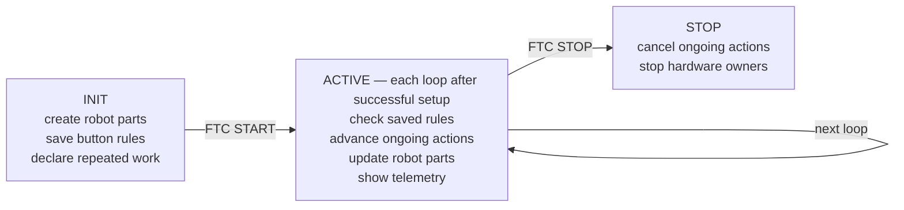

---
tags:
  - Get Started
---

# How Sushi runs your code

**Start here if:** you know basic Java and have written an FTC `LinearOpMode` or iterative
`OpMode`, but saved functions and frameworks are new to you. This page needs no robot.

Sushi does not replace the FTC SDK. It supplies a consistent way to organize the setup, repeated
work, and cleanup that every full robot needs.

## 1. Start with the FTC loops you know

In a `LinearOpMode`, your code usually sets up the robot, waits for START, and repeats a little work
inside `while (opModeIsActive())`. In an iterative `OpMode`, FTC calls `init()`, `start()`, `loop()`,
and `stop()` for you. Both styles contain the same three jobs:

| Job | `LinearOpMode` | Iterative `OpMode` |
| --- | --- | --- |
| Create robot parts | Before the active `while` loop | `init()` |
| Repeat small updates | Inside the active `while` loop | `loop()` |
| Stop safely | When the active loop ends | `stop()` |

Sushi owns that repetition and cleanup while your code describes what belongs in them.

## 2. Source: separate a current value from a reusable reader { #source }

!!! info "New concept: Source"

    A **Source** is a reusable reader, not a stored value. Save it once during setup; whenever the
    managed loop asks later, it reports the current input.

Reading `gamepad1.a` gives one `boolean` now. `GamepadDevice` turns FTC gamepad fields into Sources:

```java
boolean pressedNow = gamepad1.a;             // one current value
GamepadDevice driver = new GamepadDevice(gamepad1);
BooleanSource aEachLoop = driver.a();        // reusable reader
ScalarSource forwardEachLoop = driver.leftY();
```

`pressedNow` keeps that one value. `aEachLoop` and `forwardEachLoop` read the current value whenever
a later loop asks, which fits buttons and held drive sticks.

## 3. Saved callback and lambda: separate a call from a registered function { #saved-callback }

!!! info "New concept: saved callback and lambda"

    Calling a method runs it now. A **lambda** such as `() -> intake.setMode(...)` packages code.
    Registration saves the function; it does not run it. When a future active loop detects the
    rise, it invokes the callback synchronously during that loop; Sushi does not create a thread.

For comparison, reaching `intake.setMode(StarterIntake.Mode.COLLECT)` immediately changes the
selected request; the motor still waits for the later output update. This production button rule
registers only the saved function:

```java
program.callbackBindings().onRise(
        driver.a(),
        () -> intake.setMode(StarterIntake.Mode.COLLECT)); // register for later
```

The `onRise(...)` rule accepts the event once when A changes from released to pressed. Holding A
does not call the function again.

## 4. Task: give unfinished work a bookmark { #task }

!!! info "New concept: Task"

    A Task is a bookmark for unfinished work. The managed loop starts it once and advances it a
    little each cycle so other parts still run. It is not a thread, `sleep`, or a busy `while` loop.

Use a Task for work such as collecting for 0.75 seconds, following a route, or waiting for a sensor.
Each Task object runs once; ask the robot action method for a fresh one to repeat it.

## 5. See the whole run


**Text version:**

1. During INIT, student code creates robot parts, saves button rules, and declares repeated work.
2. After FTC START, in an ordinary run whose setup succeeded, each active FTC loop checks the
   rules, advances unfinished actions a little, updates the robot parts that own outputs, and shows
   telemetry.
3. At FTC STOP, Sushi cancels unfinished actions and stops the hardware owners. Nothing here needs
   a background thread.

## 6. Map the picture to the small Sushi entry point

The Sushi class that receives FTC's iterative calls is its managed host, `FtcRobotOpMode`. The
object that remembers what the host must run is its checklist, `RobotProgram`. The maintained
intake-only example shows the whole OpMode shape. The helper names inside `configure(...)` are
explained in the later full Build lesson; for now, notice the class it extends and the one method
it overrides:

<!-- source-excerpt: TeamCode/src/main/java/edu/ftcsushi/robots/examples/starter/opmode/StarterIntakeTeleOp.java -->
```java
@TeleOp(name = "FW Starter: Intake only", group = "FW Examples")
@Disabled
public final class StarterIntakeTeleOp extends FtcRobotOpMode {

    @Override
    protected void configure(RobotProgram program) {
        StarterProfile profile = StarterProfile.current();
        new StarterRobot(hardwareMap).declareIntakeTeleOp(program, profile, gamepad1);
    }
}
```

[`StarterIntakeTeleOp`](<https://harishv-99.github.io/2025-PhoenixPedro/api/edu/ftcsushi/robots/examples/starter/opmode/StarterIntakeTeleOp.html>)
is the generated API page; its
[Complete source: `StarterIntakeTeleOp.java`](<https://github.com/harishv-99/2025-PhoenixPedro/blob/master/TeamCode/src/main/java/edu/ftcsushi/robots/examples/starter/opmode/StarterIntakeTeleOp.java>)
supplies imports and package details. `configure(program)` runs once during INIT. `declareIntakeTeleOp(...)`
connects pieces that Sushi will use later; it does not run the intake during configuration. Do not
add another active loop.

## 7. Keep one final hardware writer

In the intake path, the button function and Task request what the robot should do; neither writes
the motor. A robot part that owns hardware is called a **mechanism**. The intake mechanism keeps a
private final-output helper, called a [**Plant**](<learn-sushi/Plants and Hardware.md#plant>). That
Plant owns the one final write path used by normal output updates and STOP cleanup.

For example: A rises → the callback requests `COLLECT` → the intake mechanism updates → its Plant
submits the motor command → telemetry shows cached software facts.

A software test can prove that `COLLECT` selected and submitted the configured command. It cannot
prove a motor is wired to the intended port, turned in the intended direction, moved a game piece,
or stopped safely. Those are separate, supervised hardware checks.

Next, [set up and verify the Sushi project](<Build and Run.md>), then complete the required
[first software tour](<First Software Tour.md>).
