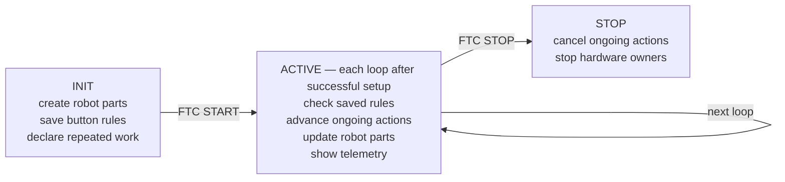

---
tags:
  - Get Started
---

# How Sushi runs your code

**Start here if:** you know basic Java and have written an FTC `LinearOpMode` or iterative
`OpMode`, but saved functions and frameworks are new to you. This page needs no robot.

Sushi does not replace the FTC SDK. It supplies a consistent way to organize the setup, repeated
work, and cleanup that every full robot needs.

## 1. Start with the FTC loops you know

In a `LinearOpMode`, your code usually sets up the robot, waits for START, and repeats a little work
inside `while (opModeIsActive())`. In an iterative `OpMode`, FTC calls `init()`, `start()`, `loop()`,
and `stop()` for you. Both styles contain the same three jobs:

| Job | `LinearOpMode` | Iterative `OpMode` |
| --- | --- | --- |
| Create robot parts | Before the active `while` loop | `init()` |
| Repeat small updates | Inside the active `while` loop | `loop()` |
| Stop safely | When the active loop ends | `stop()` |

Sushi owns that repetition and cleanup while your code describes what belongs in them.

## 2. Separate a current value from a reusable reader

Reading `gamepad1.a` gives the `boolean` value at that line. Saving it does not make the variable
change on later loops. A **reusable reader** is a small object that gets the newest value whenever
it is asked. Sushi calls this reader a **Source**; `BooleanSource` reads true/false and
`ScalarSource` reads a number. The small adapter that turns FTC gamepad fields into these readers is
`GamepadDevice`.

```java
boolean pressedNow = gamepad1.a;             // one current value
GamepadDevice driver = new GamepadDevice(gamepad1);
BooleanSource aEachLoop = driver.a();        // reusable reader
ScalarSource forwardEachLoop = driver.leftY();
```

`pressedNow` keeps one value. `aEachLoop`, returned by `driver.a()`, and `forwardEachLoop` can supply
the current value on every active loop. Continuously moving or held drive sticks need this shape.

## 3. Separate a call from a registered function

Calling a method runs it now.

For example, reaching `intake.setMode(StarterIntake.Mode.COLLECT)` immediately changes the selected
request. The motor still waits for the later output update. That direct call is a comparison, not a
line to place above the button rule below.

A no-argument function saved for later can be written as a **lambda**. The `() ->` characters
create the function; they do not run its body. Attaching a saved function to an event makes it a
**callback**. Sushi stores callback rules together in `CallbackBindings`. This production button
rule passes only the saved function:

```java
program.callbackBindings().onRise(
        driver.a(),
        () -> intake.setMode(StarterIntake.Mode.COLLECT)); // register for later
```

Registration saves the function; it does not run it.

The `onRise(...)` rule means: when A changes from released to pressed, accept that event and call
the function once. Holding A does not call it again. When a future active loop detects the rise,
it invokes the callback synchronously during that loop; Sushi does not create a thread.

## 4. Give unfinished work a bookmark

A Task is a bookmark for unfinished work.

Each active loop advances it a little, so the rest of the robot can still update. Use this shape for
work such as collecting for 0.75 seconds, following a route, or waiting for a sensor. A Task is not
a thread, `sleep`, or a busy `while` loop. Each Task object runs once; ask the robot action method
for a fresh one when you need to repeat it.

## 5. See the whole run


**Text version:**

1. During INIT, student code creates robot parts, saves button rules, and declares repeated work.
2. After FTC START, in an ordinary run whose setup succeeded, each active FTC loop checks the
   rules, advances unfinished actions a little, updates the robot parts that own outputs, and shows
   telemetry.
3. At FTC STOP, Sushi cancels unfinished actions and stops the hardware owners. Nothing here needs
   a background thread.

## 6. Map the picture to the small Sushi entry point

The Sushi class that receives FTC's iterative calls is its managed host, `FtcRobotOpMode`. The
object that remembers what the host must run is its checklist, `RobotProgram`. The maintained
intake-only example shows the whole OpMode shape. The helper names inside `configure(...)` are
explained in the later full Build lesson; for now, notice the class it extends and the one method
it overrides:

<!-- source-excerpt: TeamCode/src/main/java/edu/ftcsushi/robots/examples/starter/opmode/StarterIntakeTeleOp.java -->
```java
@TeleOp(name = "FW Starter: Intake only", group = "FW Examples")
@Disabled
public final class StarterIntakeTeleOp extends FtcRobotOpMode {

    @Override
    protected void configure(RobotProgram program) {
        StarterProfile profile = StarterProfile.current();
        new StarterRobot(hardwareMap).declareIntakeTeleOp(program, profile, gamepad1);
    }
}
```

[`StarterIntakeTeleOp.java`](<https://github.com/harishv-99/2025-PhoenixPedro/blob/master/TeamCode/src/main/java/edu/ftcsushi/robots/examples/starter/opmode/StarterIntakeTeleOp.java>)
is the complete source. `configure(program)` runs once during INIT. `declareIntakeTeleOp(...)`
connects pieces that Sushi will use later; it does not run the intake during configuration. Do not
add another active loop.

## 7. Keep one final hardware writer

In the intake path, the button function and Task request what the robot should do; neither writes
the motor. A robot part that owns hardware is called a **mechanism**. The intake mechanism keeps a
private final-output helper, called a **Plant**. That Plant owns the one final write path used by
normal output updates and STOP cleanup.

For example: A rises → the callback requests `COLLECT` → the intake mechanism updates → its Plant
submits the motor command → telemetry shows cached software facts.

A software test can prove that `COLLECT` selected and submitted the configured command. It cannot
prove a motor is wired to the intended port, turned in the intended direction, moved a game piece,
or stopped safely. Those are separate, supervised hardware checks.

Next, [set up and verify the Sushi project](<Build and Run.md>), then complete the required
[first software tour](<First Software Tour.md>).
