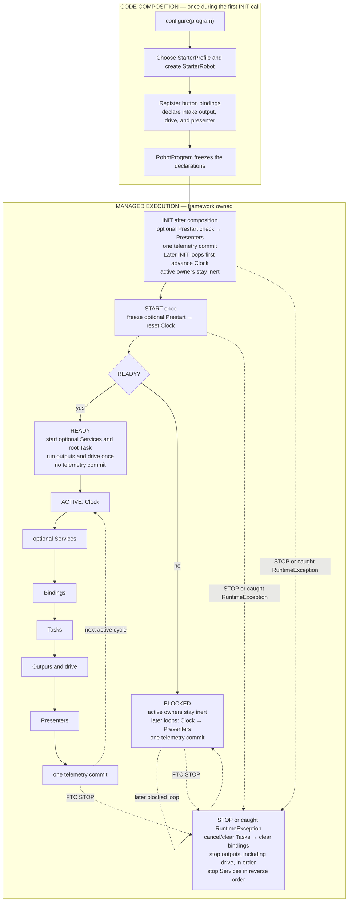

---
tags:
  - Get Started
---

# Sushi in one picture

**Learning mode:** Architecture reference

Sushi lets students describe a robot once while the framework owns the FTC lifecycle and runs
everything in a predictable order. This 15–20 minute, read-only tour uses the small Starter robot.
It requires no matching hardware, build, or example edit.

## Why use Sushi?

The FTC SDK is the foundation: it provides OpModes, `HardwareMap`, gamepads, devices, and telemetry,
while each team chooses its robot-software structure. For a one-device diagnostic, direct SDK code
may be simpler.

Sushi pays off as a robot grows:

- one predictable order for work in each loop and one managed cleanup path;
- timed actions without sleeps or frozen driver control;
- the same robot actions in TeleOp and Auto;
- one clear owner for each final actuator command; and
- software checks of the production mechanism without matching hardware.

The tradeoff is learning a small vocabulary and consistent structure. In return, students repeat
less lifecycle and coordination code. The small Starter method below declares the robot once;
Sushi runs it later.

## The student entry point

### Critical code

An ordinary Sushi OpMode overrides one method. This is the complete method from
[`StarterTeleOp.java`](<https://github.com/harishv-99/2025-PhoenixPedro/blob/master/TeamCode/src/main/java/edu/ftcsushi/robots/examples/starter/opmode/StarterTeleOp.java>):

<!-- source-excerpt: TeamCode/src/main/java/edu/ftcsushi/robots/examples/starter/opmode/StarterTeleOp.java -->
```java
@Override
protected void configure(RobotProgram program) {
    StarterProfile profile = StarterProfile.current();
    new StarterRobot(hardwareMap).declareTeleOp(program, profile, gamepad1);
}
```

**What to notice**

- The OpMode chooses configuration and delegates composition once.
- `RobotProgram` owns the loop and cleanup after `configure(...)` returns.

**Key APIs:** `FtcRobotOpMode` is the managed FTC host; `RobotProgram` is the declaration and
lifecycle surface.

`StarterProfile` supplies checked-in configuration. `StarterRobot` performs code composition: it
constructs the intake, controls, and drivetrain owners, registers the controls' bindings, and
declares the managed output, drive, and presenter roles. `StarterTeleOpControls` owns the button
meanings. `FtcRobotOpMode` calls `configure(...)` once and owns all later lifecycle calls.

## What executes after composition


**Text version:**

1. During the first FTC INIT call, `configure(program)` selects the profile, creates the Starter
   composition root, registers button bindings, and declares the intake output, drive, and a
   presenter. It then freezes those declarations. This code composition happens once.
2. After composition, the first INIT call runs an optional Prestart check, presents status, and
   commits telemetry once. Each later INIT loop first advances the clock and then does the same.
   Prestart means data-only work that may select the BLOCKED disposition and prevent active owners
   from starting. Starter TeleOp has no Prestart, Service, or root Task; none is required. Bindings,
   Tasks, managed outputs, and drive stay inert in INIT.
3. At START, Sushi freezes Prestart and resets the same clock. If READY, it starts optional
   Services and the optional root Task, then runs outputs and drive once without committing
   telemetry. A Service is recurring background ownership such as localization; a root Task is an
   Auto routine. If BLOCKED, active owners remain inert and later loops run only Clock → Presenters
   → one telemetry commit.
4. Each READY ACTIVE cycle runs Clock → optional Services → Bindings → Tasks → Outputs and drive →
   Presenters → one telemetry commit, then repeats in the same order.
5. At STOP, Sushi best-effort cancels and clears Tasks, clears bindings, stops outputs in
   declaration order—including drive—and stops Services in reverse declaration order. A managed
   phase that throws a `RuntimeException` enters the same cleanup path; Java `Error`s are not
   caught.

The diagram shows both START dispositions but omits rarer failure details. See
[Loop structure](<../core-concepts/Loop Structure.md>) when implementing Prestart or Services, or
when diagnosing the managed phase order.

## Follow one button through the cycle

When the driver first presses A during an ACTIVE cycle:

`A is true` → its rising-edge binding runs → `setMode(COLLECT)` changes the intake's request → the
later output phase updates the private Plant → the Plant performs the sole motor write → the
presenter reads the requested mode and cached applied target → Sushi commits that telemetry frame.

A **Plant** is the mechanism-owned object that resolves one actuator target and performs the final
hardware write.

Three distinctions keep that trace truthful:

- Drive sticks do not pass through callback bindings. The drive source samples them in the
  Outputs/drive phase and the drive sink performs the final drivetrain write.
- A Task changes a capability or Plant request; it does not write hardware directly. The owning
  output performs that later phase.
- An applied target reports what software resolved and submitted. It does not prove that a motor
  moved or that a game piece was collected.

## Where students make changes

| If the team wants to change… | The usual owner |
|---|---|
| A motor name, direction, permission, limit, or `collectPower` value | [`StarterProfile`](<https://harishv-99.github.io/2025-PhoenixPedro/api/edu/ftcsushi/robots/examples/starter/robot/StarterProfile.html>) and its data-only configuration |
| What A, B, X, a trigger, or a stick means | [`StarterTeleOpControls`](<https://github.com/harishv-99/2025-PhoenixPedro/blob/master/TeamCode/src/main/java/edu/ftcsushi/robots/examples/starter/robot/StarterTeleOpControls.java>) |
| The shared robot word `COLLECT` and its status | [`StarterIntake`](<https://harishv-99.github.io/2025-PhoenixPedro/api/edu/ftcsushi/robots/examples/starter/capability/intake/StarterIntake.html>) |
| How a mode becomes a bounded Plant target and hardware update | [`StarterIntakeMechanism`](<https://harishv-99.github.io/2025-PhoenixPedro/api/edu/ftcsushi/robots/examples/starter/capability/intake/StarterIntakeMechanism.html>) |

The composition root connects those owners. It should not become a control script. Mechanisms keep
their Plants private so controls, Tasks, and Auto all use the same visible intent-to-hardware path.

## Choose one next route

1. Verify the software project with [Build and run Sushi](<Build and Run.md>).
2. [Choose one robot outcome to build](<../build/README.md>) and finish its next visible checkpoint.
3. Open [Choose a Sushi topic](<Beginner's Guide.md>) only for the deeper question in front of you.
