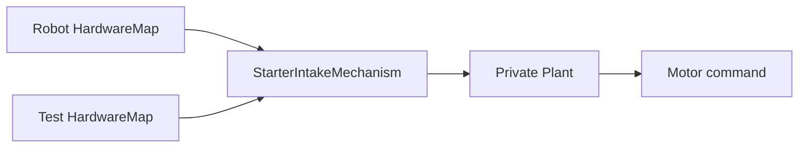

# Test a mechanism without hardware

**Learning mode:** Buildable implementation

<!-- buildable-files: TeamCode/src/test/java/edu/ftcsushi/robots/examples/starter/robot/StarterMechanismLessonTest.java -->

The complete focused test and its verification
command are included on this page.

## Goal

Continue the Starter build by exercising its real intake mechanism and Plant on a development
computer. You will see the difference between requesting a mode, running the output heartbeat, and
observing the actuator command.

**Time:** 30–40 minutes

**Prerequisite:** Complete [Get your first robot driving](<First Sushi Robot Code.md>) and steps 1–2
of [Build a robot step by step](<Build a Robot Step by Step.md>). You can run the maintained Starter
scenario immediately. When adapting it for your robot in step 3, first create your capability's
mechanism and data-only configuration using the owner pattern in
[Modern starter robot](<../examples/Modern Starter Robot.md>); you do not need to copy the entire
Starter package. Keep every physical OpMode disabled and motion permission false. This lesson uses
no Robot Controller or physical device.

## Files you will create

- `TeamCode/src/test/java/edu/ftcsushi/robots/myrobot/robot/StarterMechanismLessonTest.java`

The test uses the production `StarterIntakeMechanism` and the framework test helpers already in the
project. It does not require a second mechanism implementation.

## What stays real

The test constructs the same production `StarterIntakeMechanism` with the same ordinary
`HardwareMap + Config` constructor used on a robot. The mechanism still privately builds its Plant
through `FtcActuators`, owns the request-to-output path, and updates from a real `LoopClock`.

Only the object supplied as `HardwareMap` changes. `FtcTestHardware` is a test-only registry whose
motor probe records commands. It is not another mechanism constructor or a Plant injected from the
test.



**Text version:**

On a robot, the FTC `HardwareMap` supplies a motor. In this software scenario, the test
`HardwareMap` supplies a recording motor probe. Both flow through the same production mechanism and
its private Plant to one final motor command.

## 1. Run, then adapt, the checked-in scenario

First run the maintained scenario without copying anything:

```powershell
.\gradlew.bat --console=plain :TeamCode:testDebugUnitTest --tests edu.ftcsushi.robots.examples.starter.robot.StarterMechanismLessonTest
```

After your production mechanism exists, copy
[`StarterMechanismLessonTest.java`](<https://github.com/harishv-99/2025-PhoenixPedro/blob/master/TeamCode/src/test/java/edu/ftcsushi/robots/examples/starter/robot/StarterMechanismLessonTest.java>)
into the `edu.ftcsushi.robots.myrobot.robot` test package beside your mechanism. Let Android Studio
update its package and imports to your capability and mechanism.

Before running, search that copied test for `edu.ftcsushi.robots.examples.starter` and require
zero matches. Its imports must point to `edu.ftcsushi.robots.myrobot`; otherwise a green
test could still be exercising the repository's canonical Starter instead of your copied code.

Run only that copied test:

```powershell
.\gradlew.bat --console=plain :TeamCode:testDebugUnitTest --tests edu.ftcsushi.robots.myrobot.robot.StarterMechanismLessonTest
```

It should end with `BUILD SUCCESSFUL`.

## Complete working slice

<details>
<summary>Complete working slice: StarterMechanismLessonTest.java</summary>

Copy this file, then let Android Studio change its package and Starter imports from
`examples.starter` to `myrobot`. The block is the complete maintained file before that mechanical
package refactor.

<!-- source-file: TeamCode/src/test/java/edu/ftcsushi/robots/examples/starter/robot/StarterMechanismLessonTest.java -->
```java
package edu.ftcsushi.robots.examples.starter.robot;

import org.junit.Test;

import edu.ftcsushi.fw.testing.ManualLoopClock;
import edu.ftcsushi.fw.testing.ftc.FtcTestHardware;
import edu.ftcsushi.robots.examples.starter.capability.intake.StarterIntake;
import edu.ftcsushi.robots.examples.starter.capability.intake.StarterIntakeMechanism;

import static org.junit.Assert.assertEquals;

/** First hardware-free lesson using the production intake mechanism and its real Plant. */
public final class StarterMechanismLessonTest {

    @Test
    public void semanticRequestIsAppliedByTheNextOutputHeartbeat() {
        StarterIntakeMechanism.Config config = StarterIntakeMechanism.Config.defaults();
        config.collectPower = 0.37;
        config.ejectPower = -0.22;

        FtcTestHardware hardware = new FtcTestHardware();
        FtcTestHardware.MotorProbe motor = hardware.addMotor(config.motorName);
        StarterIntakeMechanism intake = new StarterIntakeMechanism(hardware, config);
        ManualLoopClock time = new ManualLoopClock();

        intake.setMode(StarterIntake.Mode.COLLECT);
        assertEquals(StarterIntake.Mode.COLLECT, intake.status().mode());
        assertEquals(0.0, intake.status().appliedTargetPower(), 0.0);
        assertEquals(0, motor.powerWrites());

        intake.update(time.clock());
        assertEquals(config.collectPower, intake.status().appliedTargetPower(), 0.0);
        assertEquals(config.collectPower, motor.power(), 0.0);

        intake.setMode(StarterIntake.Mode.EJECT);
        intake.update(time.nextCycle(0.02));
        assertEquals(config.ejectPower, motor.power(), 0.0);

        intake.setMode(StarterIntake.Mode.STOPPED);
        assertEquals(config.ejectPower, intake.status().appliedTargetPower(), 0.0);
        intake.update(time.nextCycle(0.02));
        assertEquals(0.0, intake.status().appliedTargetPower(), 0.0);
        assertEquals(0.0, motor.power(), 0.0);
    }
}
```

</details>

## 2. Follow request, heartbeat, and output

### Critical code

The complete test above is the central scenario: construct the real mechanism with
`FtcTestHardware`, stage a semantic mode, prove there was no early write, advance the one clock,
and assert the recorded motor output.

**What to notice**

- `setMode(...)` changes semantic intent but performs no motor write.
- `update(clock)` is the one heartbeat that turns the Plant request into a recorded command.
- The production mechanism is unchanged; only `HardwareMap` supplies recording test devices.

**Key APIs**

- `FtcTestHardware` and `MotorProbe` — test-only FTC registry and command recorder.
- `ManualLoopClock` — explicit shared cycle/time control for a deterministic scenario.
- `StarterIntakeMechanism.update(...)` — the production output heartbeat under test.

`setMode(...)` changes semantic intent and stages a Plant request. It does not write the motor.
`update(...)` is the one output heartbeat that realizes the final command. The probe records that
command; it does not pretend the motor rotated.

### When feedback determines what happens next

The device probes stay passive, but the Java scenario can react to what production code actually
did. For a subsystem with a Task and feedback, keep this causal order visible:

1. Inject any initial observations before the first sample.
2. Request the semantic action and start a fresh Task.
3. Run the Task phase, then the mechanism output phase.
4. Assert the actuator command that was actually recorded.
5. Inject the next named external fact, such as `bottomSwitchPressed` or
   `rightWheelVelocityTicksPerSec`.
6. Advance the shared `ManualLoopClock` once, again running Task before output.
7. Assert the resulting status or Task outcome.

The test therefore chooses an observation only after seeing the command that caused the question.
Students do not need to predict future commands in a per-cycle input file, and feedback is never
manufactured from a command. The optional Reference cases use small private Java fixtures to keep
setup out of the way while leaving these cause-and-effect steps in each test.

## 3. Transfer the idea

Before running, predict the recorded command sequence: `0.37`, `-0.22`, then `0.0`. Deliberately
change the EJECT assertion from `config.ejectPower` to `config.collectPower`; the focused test should
turn red because the probe distinguishes the two mechanism requests. Restore `config.ejectPower`
and confirm the test is green again. Production robot code does not change.

If a later subsystem reads a switch, encoder, or velocity, the scenario must inject that input
explicitly. Never copy an output command automatically into feedback; doing so can make a broken
controller appear correct. Assert the command first, name the external observation you are choosing,
then advance the one shared clock and inspect the result.

### Proves

The configured mode maps through the real production mechanism and Plant to the expected recorded
motor command, and a command is realized only on the mechanism heartbeat.

### Does not prove

No motor physics are modeled. The result does not establish wiring, direction, encoder polarity,
current draw, load response, safe power, physical motion, or STOP behavior on a robot.

## Verify the slice

Run the focused command again after the deliberate red/green assertion exercise. Acceptance is
`BUILD SUCCESSFUL`, with the production mechanism unchanged and the copied test importing only the
copied `myrobot` capability and mechanism.

### Next gate

Study the optional [hardware-free Reference scenarios](<../examples/Hardware-free Reference Scenarios.md>)
when your subsystem needs sensor or velocity feedback. When hardware exists, begin a separate
supervised [actuator bring-up](<../testing-calibration/Actuator Bring-up.md>) before any subsystem
experiment.
