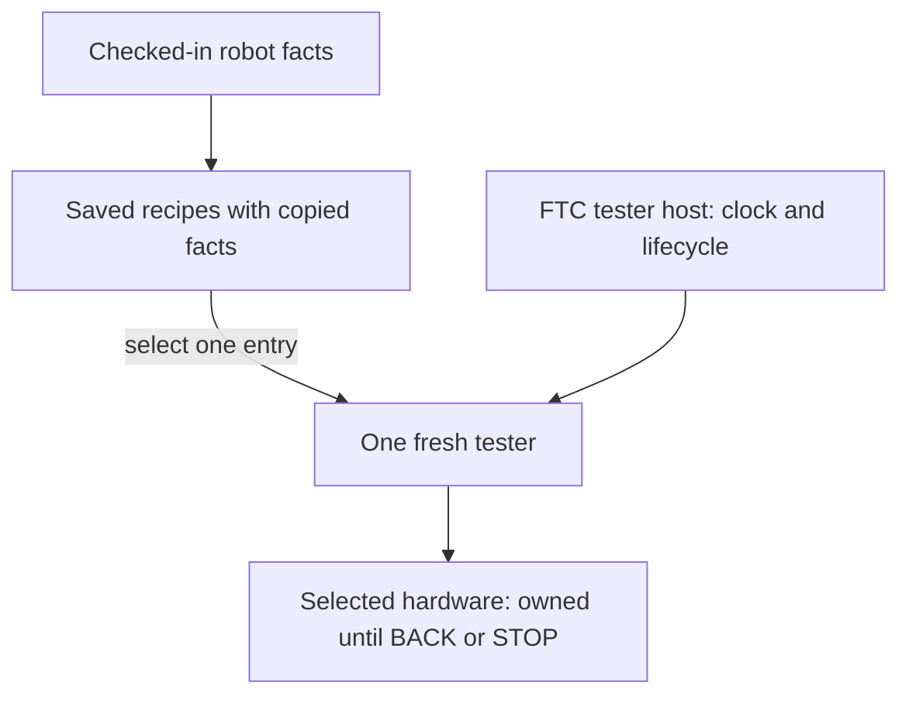

---
tags:
  - Test & Tune
---

# Add calibration testers to your robot

**Learning mode:** Integrated example

**Outcome:** connect your robot's checked-in configuration to a fresh calibration tester, a menu,
and a small FTC OpMode. The first path has no camera and commands no motors.

**Before this page:** read [Using the tester console](<Using the Tester Console.md>) for INIT,
START, BACK, STOP, and menu selection. Basic Java methods and FTC OpModes are enough; the new
construction and registration syntax is explained here. Reading needs no hardware or installation.
[Software setup](<../getting-started/Build and Run.md>) is required only to build or deploy.

This independent example uses **Pinpoint**, an odometry computer that estimates movement from
encoder-equipped tracking wheels called pods. That is an example of the integration pattern, not a
requirement for every robot. Select only testers for the supported devices actually installed on
your robot. An actuator-only robot can use [actuator bring-up](<Actuator Bring-up.md>) without
Pinpoint, a camera, or this custom suite.

## Keep the robot's facts in one place

A **profile** is data describing a robot, not a running robot or hardware owner. A **Config** is a
settings object passed to another object when it is constructed. A **snapshot** is a copy of those
settings at that boundary, not a live link to later edits.
[`CalibrationRobotProfile`](<https://harishv-99.github.io/2025-PhoenixPedro/api/edu/ftcsushi/robots/examples/calibration/CalibrationRobotProfile.html>)
is this example's checked-in authoring source. Its `current()` method returns a fresh draft;
`pinpoint()` turns those authored facts into a fresh
[`PinpointOdometryPredictor.Config`](<https://harishv-99.github.io/2025-PhoenixPedro/api/edu/ftcsushi/fw/ftc/localization/PinpointOdometryPredictor.Config.html>).
Neither method opens a device.

<!-- source-excerpt: TeamCode/src/main/java/edu/ftcsushi/robots/examples/calibration/CalibrationRobotProfile.java -->
```java
public PinpointOdometryPredictor.Config pinpoint() {
    PinpointOdometryPredictor.Config cfg = PinpointOdometryPredictor.Config.defaults();
    cfg.hardwareMapName = pinpointHardwareName;
    cfg.forwardPodOffsetLeftInches = forwardPodOffsetLeftInches;
    cfg.strafePodOffsetForwardInches = strafePodOffsetForwardInches;
    cfg.encoderResolution = encoderResolution;
    cfg.forwardPodDirection = forwardPodDirection;
    cfg.strafePodDirection = strafePodDirection;
    cfg.yawScalar = yawScalar;
    cfg.quality = odometryQuality;
    return cfg;
}
```

Read each assignment as copying one authored fact into a new Config. `return cfg` hands that data
to the caller; constructing the eventual owner is a separate operation.

For your robot, use its existing canonical configuration—the place production code already reads.
Do not keep a second calibration-only copy of motor directions, pod offsets, camera mount, or field
facts. Adapt the example's mappings to that source. Share the authored facts, not a live Pinpoint,
camera, drivetrain, or production robot instance.

These are the basic example's active values, not measured recommendations:

| Authored fact | Example value | What you must establish |
| --- | --- | --- |
| Pinpoint hardware name | `odo` | Exact name in the active FTC Robot Configuration |
| Forward/strafe pod offsets | `0.0 / 0.0 in` | Measured placement, then the pod-offset procedure |
| Both encoder directions | `FORWARD` | Each pod's reported sign under the instructed hand motion |
| Encoder resolution | `goBILDA_4_BAR_POD` | Installed pod model or reviewed custom ticks-per-inch |
| Yaw scalar | `null` | Retains factory turning calibration; not a direction-reversal setting |
| Published quality | `0.75` | Software evidence score, not proof of accurate odometry |
| Camera selection / powered-motion review | `NONE` / `false` | Optional branches remain absent |

`FORWARD` and `REVERSED` are named Java choices for encoder signs, not drive commands. Offsets are
distances from the chosen robot reference point—the point whose position Pinpoint reports—not
whichever point the robot happens to turn around. Forward-pod offset is positive left; strafe-pod
offset is positive forward. The [axis](<Robot Calibration Tutorials.md#pinpoint-axis-directions>)
and [pod-offset](<Robot Calibration Tutorials.md#pinpoint-pod-offsets>) procedures explain how to
establish those facts before accepting a result.

## Make a fresh tester for each selection

A **factory** is simply a method that makes a new object when called.
[`CalibrationTesters`](<https://harishv-99.github.io/2025-PhoenixPedro/api/edu/ftcsushi/robots/examples/calibration/CalibrationTesters.html>)
has one recipe per configured check. `axisDirections(profile)` constructs the framework's
[`PinpointAxisDirectionTester`](<https://harishv-99.github.io/2025-PhoenixPedro/api/edu/ftcsushi/fw/tools/tester/calibration/PinpointAxisDirectionTester.html>),
not a second axis-check algorithm. `new` creates the owner, and its constructor validates and
copies the supplied configuration before hardware access.
`static` allows the recipe to be called by its class name without constructing a registry object.

<!-- source-excerpt: TeamCode/src/main/java/edu/ftcsushi/robots/examples/calibration/CalibrationTesters.java -->
```java
public static PinpointAxisDirectionTester axisDirections(CalibrationRobotProfile profile) {
    CalibrationRobotProfile captured = capture(profile);
    PinpointAxisDirectionTester.Config cfg = PinpointAxisDirectionTester.Config.defaults();
    cfg.pinpoint = captured.pinpoint();
    return new PinpointAxisDirectionTester(cfg);
}
```

Here `capture(profile)` is the example's private data-copy helper, not a framework service. It
copies the draft and checks the selected backend name without opening optional devices.

The axis-check thresholds are `6.0 in` of measured X or Y change and `20.0°` of measured rotation.
They belong to the tester Config's `minTranslationInches` and `minRotationDeg` fields; change them
there before construction if your reviewed experiment requires different positive, finite values.

`manualPodOffsets(profile)` makes a
[`PinpointPodOffsetCalibrator`](<https://harishv-99.github.io/2025-PhoenixPedro/api/edu/ftcsushi/fw/tools/tester/calibration/PinpointPodOffsetCalibrator.html>)
from the same authored Pinpoint facts. Its Config has `mecanum = null`, meaning no drivetrain, and
its constructor receives a null camera-factory builder, meaning no camera. The tool therefore
cannot power the robot; the operator moves it by hand. Its physical procedure and solve limits
remain in the [pod-offset runbook](<Robot Calibration Tutorials.md#pinpoint-pod-offsets>).

<!-- source-excerpt: TeamCode/src/main/java/edu/ftcsushi/robots/examples/calibration/CalibrationTesters.java -->
```java
public static PinpointPodOffsetCalibrator manualPodOffsets(CalibrationRobotProfile profile) {
    CalibrationRobotProfile captured = capture(profile);
    PinpointPodOffsetCalibrator.Config cfg = PinpointPodOffsetCalibrator.Config.defaults();
    cfg.pinpoint = captured.pinpoint();
    cfg.mecanum = null;
    return new PinpointPodOffsetCalibrator(cfg, null);
}
```

## Register recipes, not already-running testers

Calling `axisDirections(profile)` runs that method now. A menu must instead save a recipe until the
operator selects the entry. A Java **lambda**, such as `() -> axisDirections(profile)`, describes
that later call: empty parentheses mean it needs no arguments when invoked. Registration does not
execute it and does not start another thread.

[`TesterSuite`](<https://harishv-99.github.io/2025-PhoenixPedro/api/edu/ftcsushi/fw/tools/tester/TesterSuite.html>)
stores the recipe as a `Supplier<TeleOpTester>`: Java's spelling for a function that returns a
tester. Each selection must return a fresh inactive owner; do not construct a tester first and
keep returning that same object. The example captures profile data when it builds the suite, so
editing an old draft cannot change a later selection inside that existing suite.

This is the camera-free start of `create(profile)`. It saves two recipes using the captured draft:

<!-- source-excerpt: TeamCode/src/main/java/edu/ftcsushi/robots/examples/calibration/CalibrationTesters.java -->
```java
CalibrationRobotProfile captured = capture(profile);
TesterSuite suite = new TesterSuite().setTitle("Robot calibration")
        .setHelp("Record -> rebuild -> fresh configured verification");
suite.add("Pinpoint axis directions", "Hand motion; verify the captured signs",
        () -> axisDirections(captured));
suite.add("Manual pod offsets", "No drive or camera; hand rotation and recentering",
        () -> manualPodOffsets(captured));
```

Each `add` names the menu entry, its help, and its recipe. With optional branches off, the method
then returns this `suite`. The later lessons show the extra registrations, not a different host.

The default menu contains the configured axis check and manual pod-offset check only. Optional
camera and powered entries are not constructed while their choices remain `NONE` and `false`.
[`StandardTesters.register(...)`](<https://harishv-99.github.io/2025-PhoenixPedro/api/edu/ftcsushi/fw/tools/tester/StandardTesters.html#register(edu.ftcsushi.fw.tools.tester.TesterSuite)>)
can add generic bring-up groups to an adopting team's menu. It does not create configured Pinpoint
checks or read your robot profile, and is deliberately unnecessary for this two-entry first pass.
The ready standalone framework menu and this configured menu serve different evidence needs.

## Let the tester host own the FTC loop

[`CalibrationTestersOpMode`](<https://harishv-99.github.io/2025-PhoenixPedro/api/edu/ftcsushi/robots/examples/calibration/CalibrationTestersOpMode.html>)
extends [`FtcTeleOpTesterOpMode`](<https://harishv-99.github.io/2025-PhoenixPedro/api/edu/ftcsushi/fw/ftc/FtcTeleOpTesterOpMode.html>).
`extends` reuses the specialized tester host; `@Override` identifies its `createTester()` method
that this example supplies. `@TeleOp` provides the Driver Station label, and `@Disabled` keeps the
example unselectable until the adopting team reviews it.

<!-- source-excerpt: TeamCode/src/main/java/edu/ftcsushi/robots/examples/calibration/CalibrationTestersOpMode.java -->
```java
@TeleOp(name = "FW Example: Calibration Testers", group = "FW Examples")
@Disabled
public final class CalibrationTestersOpMode extends FtcTeleOpTesterOpMode {
    @Override
    protected TeleOpTester createTester() {
        return CalibrationTesters.create(CalibrationRobotProfile.current());
    }
}
```

The host calls `createTester()` during INIT. It supplies the shared clock and forwards the selected
tester's lifecycle; your OpMode does not add its own loop, bindings, telemetry commit, or hardware
updates. The suite initializes only the selected child. BACK stops that child before returning to
the menu, and FTC STOP cleans up the active tree. The tester has exclusive hardware ownership for
that diagnostic run; do not run production owners beside it.



**Text version:** setup copies facts and saves recipes without opening their hardware. Selecting
one entry creates a fresh tester. The host supplies its clock and lifecycle; that selected tester
owns its devices until BACK or STOP. Only configuration is reused, never a live production owner.

## Recreate this in your robot

1. Work in [your robot's package](<../build/README.md#author-in-your-robot>), not the example package.
   Map its canonical configuration into the two fresh tester factories above.
2. Register those factories in one suite. Keep camera and powered branches absent until you need
   and review them; do not copy unrelated mechanisms into the fixture.
3. Add the thin tester OpMode, give it your robot's label, and initially keep `@Disabled`.
4. Check your actual device name, pod model and configuration. Follow the axis/pod runbook and
   agree on a supervised stop plan before removing `@Disabled`, rebuilding and deploying.
5. Select your entry on the Driver Station. The maintained example's label is
   **FW Example: Calibration Testers**. Use physical gamepad 1 to navigate; the selected tester
   shows its sampling controls. This custom host is not the ready Panels-control entry.

Opening the default menu does not construct a camera or motor. Selecting a Pinpoint check does
configure and reset that device; wait still for `READY` as the runbook requires. No-motor software
does not make hand movement, lifting, wiring, or the surrounding robot physically safe.

## Inspect the maintained software example

The three main files below are the compiling authority. The excerpts on this page explain the
important assembly; complete source supplies imports, Javadocs, and optional branches.

- [Complete source: `CalibrationRobotProfile.java`](<https://github.com/harishv-99/2025-PhoenixPedro/blob/master/TeamCode/src/main/java/edu/ftcsushi/robots/examples/calibration/CalibrationRobotProfile.java>) — canonical example facts and mappings.
- [Complete source: `CalibrationTesters.java`](<https://github.com/harishv-99/2025-PhoenixPedro/blob/master/TeamCode/src/main/java/edu/ftcsushi/robots/examples/calibration/CalibrationTesters.java>) — fresh owners and menu registration.
- [Complete source: `CalibrationTestersOpMode.java`](<https://github.com/harishv-99/2025-PhoenixPedro/blob/master/TeamCode/src/main/java/edu/ftcsushi/robots/examples/calibration/CalibrationTestersOpMode.java>) — disabled host.

**Question:** do the real example mappings pass configured facts to fresh owners while keeping
inactive branches absent? The supplied maintainer checks keep those mappings and constructors real;
they inspect configuration, selection and rejection behavior without asserting robot motion.

Optional verification after software setup:

=== "Windows"

    ```powershell
    .\gradlew.bat --console=plain :TeamCode:compileDebugJavaWithJavac :TeamCode:testDebugUnitTest --tests 'edu.ftcsushi.robots.examples.calibration.*'
    ```

=== "macOS"

    ```bash
    ./gradlew --console=plain :TeamCode:compileDebugJavaWithJavac :TeamCode:testDebugUnitTest --tests 'edu.ftcsushi.robots.examples.calibration.*'
    ```

Expected result: compilation and the example's configuration and inactive-construction checks pass.
This proves only the checked software contracts. It does not prove your adapted code, installed
hardware, an actual INIT/BACK/STOP run, calibration, physical motion, or safe stop. Test your own
mappings, then perform the supervised hardware procedure.

## Record, rebuild, and verify

The handoff is **record -> rebuild -> fresh robot-configured tester -> verify**. Use
[Keep one calibration record](<Robot Calibration Tutorials.md#keep-one-calibration-record>) to connect
the observed facts to the exact configuration being tested. Put a value being considered into your
canonical configuration for a reviewed validation run, rebuild and deploy, then open a newly built
suite so its testers capture the changed values. Deployment is not physical acceptance: verify
through the configured tester and the production owner before accepting ordinary robot use.
No menu entry saves results, changes your profile, or certifies physical calibration automatically.

The basic integration is complete here. Return to the
[calibration runbook](<Robot Calibration Tutorials.md>) for one physical fact. Select an optional
extension only when needed: [vision](<Add Vision to Your Calibration Suite.md>),
[powered calibration](<Enable Powered Calibration.md>), or
[guided order and status](<Guided Calibration Walkthroughs.md>).
