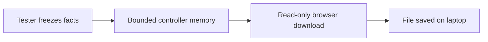

---
tags:
  - Test & Tune
---

# Download and inspect experiment results

**Learning mode:** Optional operational runbook

**Outcome:** save one tester result on a laptop and explain what that file does, and does not,
establish. Reading needs no robot or new Java knowledge.

**Before operating:** read [Using the tester console](<Using the Tester Console.md>) and the runbook
for your selected tool. Keep its reviewed setup, controls and physical STOP plan unchanged. You
need a laptop browser connected to the same trusted local robot network.

## Save a finished result

A **report** is a saved answer to the tool's question: for example, candidate odometry offsets
and the measurements supporting them. **Frozen** means later sensor readings cannot change that
saved answer. It does not mean the calibration is accepted or physically correct.

1. Run the existing tool and reach its result boundary in the table below. No additional recording
   button or robot configuration is needed for these reports.
2. Find the result download URL in that tool's telemetry. Open that exact address in the laptop
   browser; do not guess the address from the separate Panels port.
3. On the result page, choose **Download** and save the attachment on the laptop. Opening the page
   is not proof the file was saved: check the browser's download result and open the saved file.
4. Add its location and displayed trial/segment identity to your existing lab card. Keep physical
   observations and the robot/configuration revision there too; the file cannot infer them.
5. Download before replacing the result, leaving the selected tester with BACK, or FTC STOP.
   Those actions may discard unsaved evidence. INIT-to-START also clears INIT download links.

!!! danger "Danger: never delay STOP for a download"

    FTC Driver Station STOP and robot power remain the emergency controls. A download is optional;
    abandoning an unsaved result is preferable to delaying a required stop. Ending a controller
    trial requests zero or hold; it is not the same as stopping the OpMode.

The page only transfers text. It does not connect another Panels control client, start a trial,
change a setting or command hardware. Keep exactly one Panels control client when the selected
tuning host requires it. Use the download on a trusted local network for non-secret results:
the link is not encrypted authentication.

## Know which answer was saved

| Tool | Result boundary | What the file represents |
| --- | --- | --- |
| Actuator bring-up | Y finalizes while disarmed after the required jog | Tested direction and optional endpoint candidate; not clearance under load |
| Pinpoint axis directions | An instructed movement sample finishes | Retained completed axis deltas and existing keep/change advice; earlier samples remain historical |
| Pinpoint pod offsets | An attempt finishes or is aborted/rejected | Available attempt evidence, absolute replacement offsets when valid, or the failure explanation |
| Camera mount | A accepts a new eligible sample | Fixed-setup batch snapshot and available averaged mount; not completed calibration |
| Reference flywheel experiment | Target reached, time limit, or B abort; then normal zero realization | One numbered trial's frozen result, not a physical acceptance decision |
| Velocity/position controller tuner | B or automatic zero/hold, then normal output realization | The latest segment's bounded recording and final metrics |

Each tool keeps its own existing sample/reset rules. Rejected camera samples do not become new
accepted evidence. A failed pod solve has no candidate assignment. An axis report does not prove
that the instructed physical movement was actually performed. Editing camera geometry or clearing
a batch removes the old download. Starting another accepted tuner segment removes its predecessor's
download; a rejected draft does not. This is not a whole-session archive.

The files retain numerical values with their units instead of relying on rounded screen text.
`UNRECORDED` means the owner did not retain that fact; it must not be interpreted as zero. For
example, a loop's **processing time** says when software handled evidence, while **acquisition
time** says when a sensor measured it. Download time is neither of those times.

Keep the [calibration record](<Robot Calibration Tutorials.md#keep-one-calibration-record>) or
[experiment lab card](<../examples/Subsystem Experiments.md#copyable-lab-card-and-results-sheet>)
as the place for independent observations, configuration deployment and human acceptance. A generic
tester still uses its generic settings; downloading them does not make it a robot-configured tool.

## Understand where the file lives



The tester supplies an immutable result to the host's bounded memory. The existing FTC web server
copies that result to the browser, and the laptop saves the file. There is no new controller result
directory or background hardware sampler. One active download may finish its original result even
after the tester clears it; an old link never changes to serve a replacement result.

If the URL is unavailable, retain the on-screen facts manually if safe. Offline/custom hosts may
not provide downloads. A stale link requires a current result, not repeated requests to the old
address. If another attachment is still transferring, let it finish or cancel that download before
retrying. Physical-controller connectivity and loop cost must be checked on the adopting robot.

## Optional: replay controller response metrics

A **recording** contains a sequence, not just a final answer. The controller tuners save a JSONL
file: text with one structured record per line. **Response metrics** summarize the measured
response, such as settling time. **Replay** here means feeding the recorded inputs through Sushi's
same metric calculation on the laptop and comparing the result. It does not run a motor controller,
reprocess camera images or simulate a robot.

After [software setup](<../getting-started/Build and Run.md>), run from the repository root. Replace
`PATH_TO_DOWNLOADED_FILE.jsonl` with your downloaded `control-<segment>.jsonl` absolute path; quoting the
whole property argument allows spaces in that path.

=== "Windows"

    ```powershell
    .\gradlew.bat --console=plain :TeamCode:replayControlExperiment '-Precording=PATH_TO_DOWNLOADED_FILE.jsonl'
    ```

=== "macOS"

    ```bash
    ./gradlew --console=plain :TeamCode:replayControlExperiment '-Precording=PATH_TO_DOWNLOADED_FILE.jsonl'
    ```

| Reader result | Meaning |
| --- | --- |
| `COMPLETE_MATCH` | All required recorded operations reproduce the retained metrics with the current code |
| `INCOMPLETE` | Recording limits omitted required operations; exact agreement cannot be established |
| `MISMATCH` | Complete recorded inputs produce different metrics with the current code |

Malformed, unsupported or damaged files fail with an explanation rather than becoming empty
observations. `INCOMPLETE` and `MISMATCH` also make the command unsuccessful. A matching result
does not identify an unrecorded original code revision or prove physical success. Ordinary `.txt`
calibration/experiment reports are for inspection and are not inputs to this replay command.

**Checkpoint:** the saved file contains the expected trial or batch, its available configuration,
and its limitations. You have preserved software evidence, not proved physical accuracy. Next,
attach it to the existing record and decide whether more reviewed trials or a configuration change
are justified. Maintainers can read the [exact format and extension contract](<../maintainers/Result Downloads and Recordings.md>).
